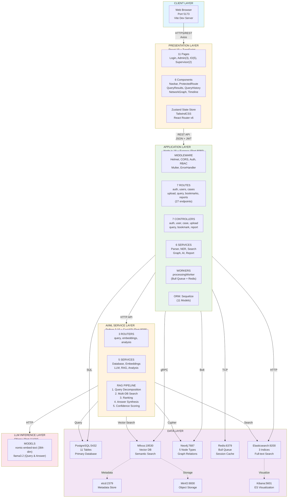

# UFDR System - System Architecture Diagram

## High-Level System Architecture (Mermaid)

## Component Breakdown

### Frontend (React + TypeScript)
- **11 Pages**: Login, Admin (Dashboard, UserList, CaseList, CreateUser, CreateCase), IO (Dashboard, CaseDetail, QueryInterface, Bookmarks, ReportGenerator), Supervisor (Dashboard, CaseOverview)
- **6 Components**: Navbar, ProtectedRoute, QueryResults, QueryHistory, NetworkGraph, Timeline
- **State Management**: Zustand (authStore)
- **Routing**: React Router v6
- **Styling**: TailwindCSS
- **HTTP Client**: Axios

### Backend (Node.js + Express)
- **7 Routes**: auth, users, cases, upload, query, bookmarks, reports
- **27 API Endpoints**: RESTful API
- **7 Controllers**: Business logic handlers
- **6 Services**: Parser, NER, Search, Graph, AI Client, Report Generator
- **11 Models**: Sequelize ORM (users, sessions, cases, devices, data_sources, processing_jobs, case_queries, evidence_bookmarks, entity_tags, case_reports, audit_log)
- **Background Workers**: Bull queue with Redis for async processing

### AI Service (Python + FastAPI)
- **3 Routers**: query, embeddings, analysis
- **5 Services**: Database connector, Embeddings, LLM, RAG pipeline, Analysis
- **RAG Pipeline**: Query decomposition → Multi-DB search → Ranking → Answer synthesis

### Databases
- **PostgreSQL**: Primary relational database (11 tables)
- **Elasticsearch**: Full-text search (3 indices: messages, calls, contacts)
- **Neo4j**: Graph database (5 node types, 4 relationship types)
- **Redis**: Job queue and session cache
- **Milvus**: Vector database for semantic search (optional)
- **etcd**: Metadata store for Milvus
- **MinIO**: Object storage for Milvus

### LLM Layer
- **Ollama**: Local LLM server
- **nomic-embed-text**: 384-dimensional embeddings
- **llama3.2**: Query processing and answer generation

## Technology Stack

| Layer | Technologies |
|-------|-------------|
| **Frontend** | React 19, TypeScript, Vite, TailwindCSS, Zustand, Axios, React Router v6, Lucide Icons |
| **Backend** | Node.js 18, Express.js, Sequelize, JWT, Bcrypt, Multer, Bull, Winston, Helmet, CORS, PDFKit |
| **AI Service** | Python 3.10, FastAPI, Ollama, AsyncIO, AsyncPG, NumPy, Loguru |
| **Databases** | PostgreSQL 15, Elasticsearch 8.11, Neo4j 5.13, Redis 7, Milvus 2.3 |
| **DevOps** | Docker, Docker Compose, Git |

## Port Mapping

| Service | Port | Purpose |
|---------|------|---------|
| Frontend | 5173 | Vite dev server |
| Backend | 8080 | Express API |
| AI Service | 8005 | FastAPI |
| PostgreSQL | 5432 | Primary database |
| Elasticsearch | 9200 | Search engine |
| Neo4j HTTP | 7474 | Graph browser |
| Neo4j Bolt | 7687 | Graph database |
| Redis | 6379 | Queue & cache |
| Milvus | 19530 | Vector database |
| etcd | 2379 | Metadata store |
| MinIO | 9000 | Object storage |
| Kibana | 5601 | ES visualization |
| Ollama | 11434 | LLM inference |
