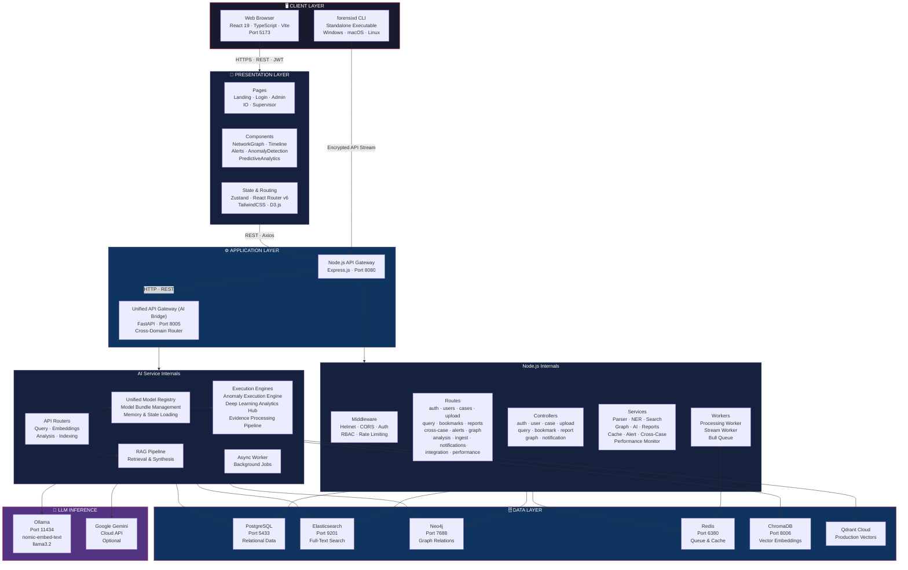
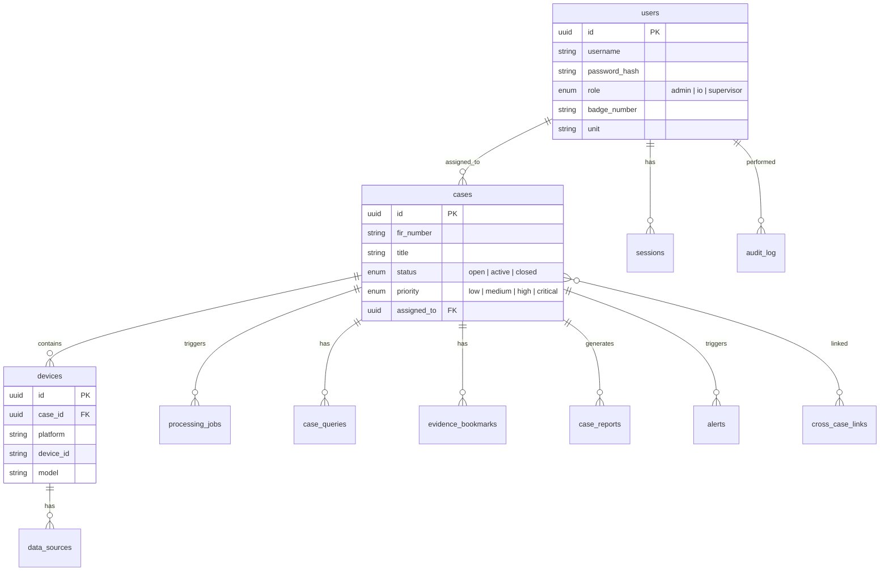
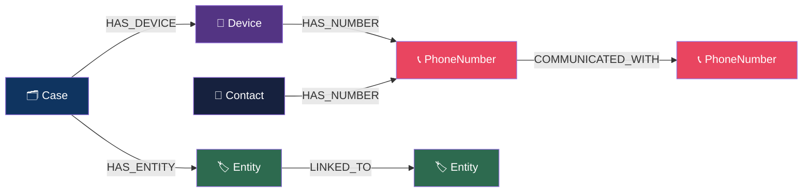
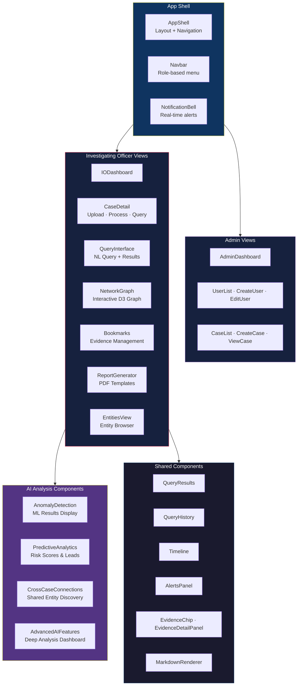
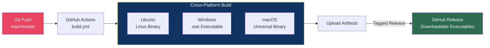

# CopSight AI — System Architecture

This document provides a comprehensive view of the CopSight AI platform architecture, showing how each layer, component, and service interconnects to form the complete forensic analysis system.

---

## High-Level System Architecture

---

## Forensixd CLI Architecture

The `forensixd` extraction engine operates as a standalone tool with its own modular architecture:

```mermaid
graph LR
    subgraph CLI["CLI Layer"]
        Main["cli.py<br/>Click CLI + Interactive Shell"]
    end

    subgraph Core["Core Engine"]
        Session["ForensicSession<br/>Session lifecycle<br/>Artifact registration"]
        Detector["DeviceDetector<br/>USB device scanning<br/>Platform identification"]
        Auth["AuthManager<br/>Browser-based login<br/>JWT token management"]
        Hasher["IntegrityHasher<br/>MD5 + SHA-256<br/>Merkle root"]
        Logger["AuditLogger<br/>JSONL chain-of-custody<br/>Tamper detection"]
    end

    subgraph Extractors["Platform Extractors"]
        Android["AndroidExtractor<br/>ADB Protocol"]
        iOS["iOSExtractor<br/>pymobiledevice3"]
        Windows["WindowsExtractor<br/>Direct / Image"]
        DiskImg["DiskImageExtractor<br/>E01 / DD / Raw"]
    end

    subgraph Parsers["Data Parsers"]
        SQLite["SQLiteParser"]
        Plist["PlistParser"]
        Registry["RegistryParser"]
        subgraph Apps["Application Parsers"]
            WA["WhatsApp"]
            TG["Telegram"]
            iMsg["iMessage"]
            Sig["Signal"]
            Br["Browsers"]
            CL["Call Logs"]
            Em["Email"]
        end
    end

    subgraph Writers["Output Writers"]
        UFDR["UFDRWriter<br/>.ufdr package"]
        DFXML["DFXMLWriter<br/>acquisition.dfxml"]
        Report["ReportWriter<br/>HTML report"]
        APIStream["ApiStreamWriter<br/>Encrypted real-time<br/>upload to server"]
    end

    subgraph Legal["Legal Compliance"]
        AuthZ["AuthorizationManager<br/>Court order · Consent<br/>Examiner ID"]
        CoC["ChainOfCustody<br/>Event logging<br/>Hash verification"]
    end

    Main --> Core
    Core --> Extractors
    Extractors --> Parsers
    Parsers --> Writers
    Core --> Legal

    style CLI fill:#e94560,color:#fff
    style Core fill:#0f3460,color:#fff
    style Extractors fill:#533483,color:#fff
    style Parsers fill:#16213e,stroke:#533483,color:#fff
    style Apps fill:#1a1a2e,stroke:#0f3460,color:#fff
    style Writers fill:#2d6a4f,color:#fff
    style Legal fill:#c9184a,color:#fff
```

---

## Backend Service Architecture

```mermaid
graph TD
    subgraph Middleware["Request Pipeline"]
        Helmet["Helmet<br/>Security Headers"]
        CORS["CORS<br/>Origin Control"]
        JWT["JWT Auth<br/>Token Validation"]
        RBAC["RBAC<br/>Role Check"]
        CaseAccess["Case Access<br/>Assignment Check"]
        RateLimit["Rate Limiter<br/>auth · search · upload · AI"]
        PerfMon["Performance<br/>Request Metrics"]
    end

    subgraph Routes["Route Groups"]
        AuthR["Auth Routes"]
        UserR["User Routes"]
        CaseR["Case Routes"]
        UploadR["Upload Routes"]
        QueryR["Query Routes"]
        BookmarkR["Bookmark Routes"]
        ReportR["Report Routes"]
        CrossR["Cross-Case Routes"]
        AlertR["Alert Routes"]
        GraphR["Graph Routes"]
        AnalysisR["Analysis Routes"]
        IngestR["Ingest Routes"]
        NotifR["Notification Routes"]
        IntegR["Integration Routes"]
        PerfR["Performance Routes"]
    end

    subgraph ServiceLayer["Business Logic"]
        Parser["UFDR Parser<br/>XML · JSON parsing"]
        NER["NER Engine<br/>Entity extraction<br/>Phone · Email · ID · URL · Crypto"]
        SearchSvc["Search Service<br/>Elasticsearch queries"]
        GraphSvc["Graph Service<br/>Neo4j operations"]
        AISvc["AI Client<br/>FastAPI bridge"]
        ReportGen["Report Generator<br/>PDFKit rendering"]
        CacheSvc["Cache Service<br/>Redis caching"]
        AlertSvc["Alert Service<br/>Rule engine"]
        CrossCaseSvc["Cross-Case Service<br/>Entity correlation"]
    end

    Middleware --> Routes --> ServiceLayer

    style Middleware fill:#0f3460,color:#fff
    style Routes fill:#16213e,stroke:#533483,color:#fff
    style ServiceLayer fill:#1a1a2e,stroke:#e94560,color:#fff
```

---

## Database Schema Overview

### PostgreSQL — Relational Data

### Elasticsearch — Search Indices

| Index | Documents | Key Fields |
|-------|-----------|------------|
| `copsight-messages` | SMS, WhatsApp, Telegram messages | sender, receiver, body, timestamp, source_app |
| `copsight-calls` | Call logs | caller, callee, duration, direction, timestamp |
| `copsight-contacts` | Contact records | name, phone_number, email, organization |

### Neo4j — Graph Schema

---

## Frontend Component Architecture

---

## CI/CD Pipeline

The CI/CD pipeline:
1. Triggers on pushes to `main`/`master` affecting forensixd code
2. Builds standalone executables on **Linux**, **Windows**, and **macOS** simultaneously
3. Injects production server URLs via GitHub Secrets
4. Bundles Android Platform Tools (ADB) into each executable
5. Creates GitHub Releases with downloadable binaries on tagged versions

---

## Service Communication Map

| From | To | Protocol | Purpose |
|------|----|----------|---------|
| Browser | Backend | HTTPS + JWT | All user interactions |
| forensixd CLI | Backend | HTTPS + JWT | Real-time evidence streaming |
| Backend | AI Service | HTTP REST | Query processing, analysis requests |
| Backend | PostgreSQL | TCP (Sequelize) | CRUD operations |
| Backend | Elasticsearch | HTTP | Full-text search and indexing |
| Backend | Neo4j | Bolt | Graph queries and mutations |
| Backend | Redis | TCP | Job queue, caching, sessions |
| AI Service | PostgreSQL | TCP (AsyncPG) | Data retrieval for analysis |
| AI Service | Elasticsearch | HTTP | Evidence search |
| AI Service | Neo4j | Bolt | Graph analysis |
| AI Service | ChromaDB/Qdrant | HTTP/gRPC | Vector similarity search |
| AI Service | Ollama | HTTP | LLM inference |
| AI Service | Gemini API | HTTPS | Cloud LLM (optional) |

---

## Port Reference

| Service | Port | Protocol |
|---------|------|----------|
| Frontend (Vite) | 5173 | HTTP |
| Backend API | 8080 | HTTP |
| AI Service | 8005 | HTTP |
| PostgreSQL | 5433 | TCP |
| Elasticsearch | 9201 | HTTP |
| Neo4j Browser | 7475 | HTTP |
| Neo4j Bolt | 7688 | Bolt |
| Redis | 6380 | TCP |
| ChromaDB | 8006 | HTTP |
| Kibana | 5601 | HTTP |
| Ollama | 11434 | HTTP |
