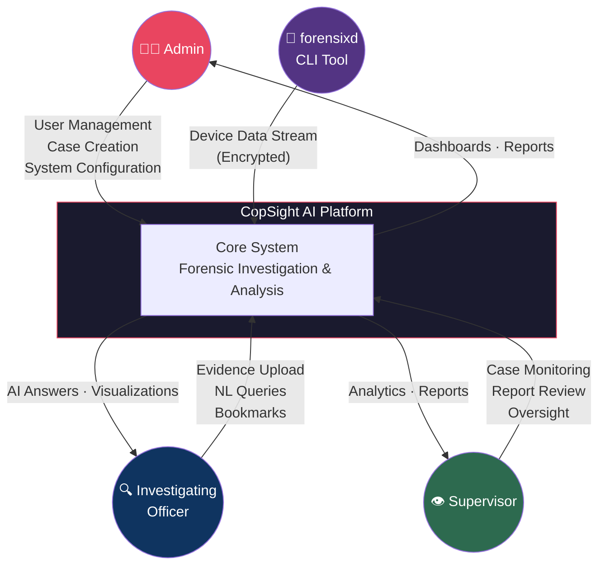
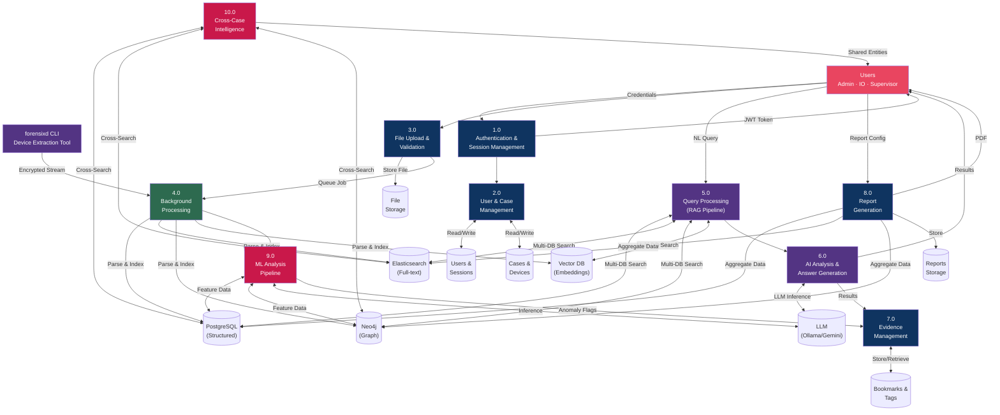
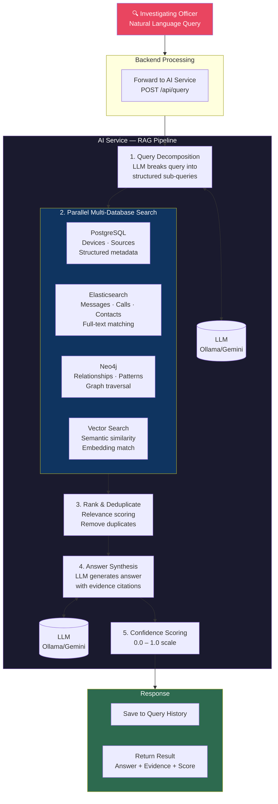
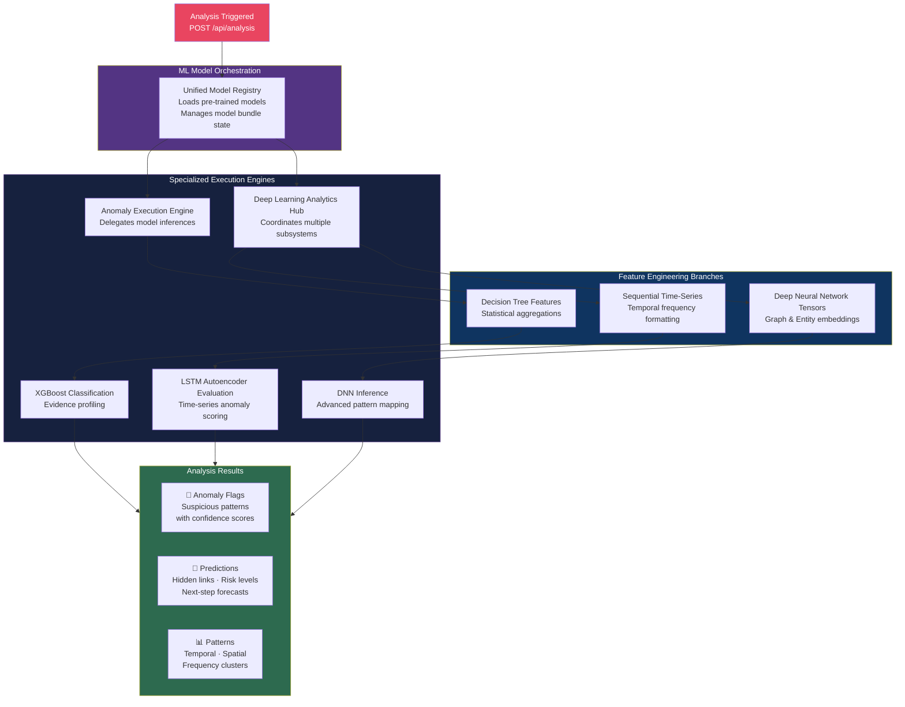
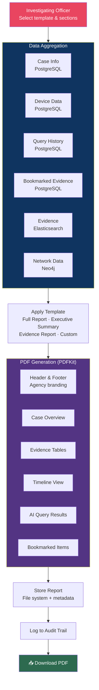

# CopSight AI — Data Flow Diagrams

This document traces how data moves through the CopSight AI platform — from initial device extraction through processing, analysis, and final report generation.

---

## Level 0 — Context Diagram

The system boundary and all external actors interacting with the platform:

---

## Level 1 — Main System Processes

How the major subsystems interact with data stores:

---

## Level 2 — Detailed Process Flows

### 2.1 Forensixd Device Extraction Flow

How `forensixd` acquires data from a physical device:

```mermaid
flowchart TD
    Start["forensixd acquire<br/>Command Invocation"]

    subgraph Auth["Authentication Phase"]
        BrowserAuth["Open Browser Login<br/>CopSight AI web UI"]
        GetToken["Receive JWT Token<br/>+ Encryption Key"]
        FetchCases["Fetch Assigned Cases<br/>from Backend API"]
        SelectCase["Officer Selects Case"]
    end

    subgraph Detection["Device Detection Phase"]
        USBScan["USB Device Scan<br/>pyusb enumeration"]
        PlatformID["Platform Identification<br/>Android · iOS · Windows"]
        DeviceInfo["Capture Device Info<br/>Model · Serial · OS Version<br/>Root/Jailbreak Status"]
    end

    subgraph Legal["Legal Authorization Phase"]
        CaseAuth["Case Metadata<br/>Case Number · Court Order Ref"]
        ConsentCapture["Consent Capture<br/>Court Order · Voluntary · Emergency"]
        ExaminerID["Examiner Identification"]
    end

    subgraph Extraction["Data Extraction Phase"]
        LevelSelect["Select Extraction Level<br/>Logical · File System · Physical"]
        ProfileSelect["Select Profile<br/>Textual · Media · Everything"]
        RunExtractor["Run Platform Extractor<br/>Yield Artifacts"]
        HashArtifact["Hash Each Artifact<br/>MD5 + SHA-256"]
    end

    subgraph Output["Output Phase"]
        StreamAPI["Stream to Server<br/>Encrypted real-time upload"]
        WriteDFXML["Write DFXML<br/>acquisition.dfxml"]
        WriteUFDR["Write UFDR Package<br/>{session_id}.ufdr"]
        WriteHTML["Generate HTML Report<br/>report.html"]
        MerkleRoot["Compute Merkle Root<br/>Session integrity hash"]
    end

    Start --> Auth --> Detection --> Legal --> Extraction --> Output

    style Start fill:#e94560,color:#fff
    style Auth fill:#0f3460,color:#fff
    style Detection fill:#533483,color:#fff
    style Legal fill:#c9184a,color:#fff
    style Extraction fill:#16213e,stroke:#533483,color:#fff
    style Output fill:#2d6a4f,color:#fff
```

---

### 2.2 File Upload & Background Processing Flow

How uploaded UFDR files are processed into searchable evidence:

```mermaid
flowchart TD
    IO["Investigating Officer<br/>Uploads UFDR File"]

    subgraph Upload["Upload Phase"]
        Validate["Validate File Format<br/>XML or JSON"]
        Store["Store File on Disk<br/>backend-node/uploads/"]
        CreateJob["Create Processing Job<br/>Track status"]
        QueueJob["Queue Job<br/>Bull Queue → Redis"]
    end

    subgraph Processing["Background Processing (Worker)"]
        ParseFile["Parse UFDR File<br/>Extract raw data objects"]
        ExtractMsg["Extract Messages<br/>SMS · WhatsApp · Telegram"]
        ExtractCalls["Extract Call Logs<br/>Duration · Direction · Time"]
        ExtractContacts["Extract Contacts<br/>Names · Numbers · Emails"]
    end

    subgraph NER["Entity Extraction"]
        Phones["📞 Phone Numbers<br/>International classification"]
        Emails["📧 Email Addresses"]
        IDs["🆔 Indian IDs<br/>Aadhaar · PAN · Passport"]
        URLs["🔗 URLs"]
        Crypto["₿ Crypto Addresses<br/>Bitcoin · Ethereum"]
        IPs["🌐 IP Addresses"]
    end

    subgraph Indexing["Parallel Database Indexing"]
        IndexPG["PostgreSQL<br/>Structured records"]
        IndexES["Elasticsearch<br/>Full-text index<br/>3 indices"]
        IndexNeo["Neo4j<br/>Communication graph<br/>Nodes & Relationships"]
        IndexVec["Vector DB<br/>Semantic embeddings"]
    end

    Complete["✅ Processing Complete<br/>Status: COMPLETED"]

    IO --> Upload
    Upload --> Processing
    Processing --> NER
    NER --> Indexing
    Indexing --> Complete

    style IO fill:#e94560,color:#fff
    style Upload fill:#0f3460,color:#fff
    style Processing fill:#533483,color:#fff
    style NER fill:#16213e,stroke:#e94560,color:#fff
    style Indexing fill:#2d6a4f,color:#fff
    style Complete fill:#2d6a4f,color:#fff
```

---

### 2.3 RAG Query Processing Flow

How natural language queries are transformed into evidence-backed answers:

---

### 2.4 ML Analysis Pipeline Flow

How the anomaly detection and predictive analytics engines process case data:

---

### 2.5 Report Generation Flow

How the platform assembles court-ready PDF reports:

---

## Data Store Inventory

| Store | Technology | What It Holds |
|-------|-----------|---------------|
| **Users & Sessions** | PostgreSQL | User accounts, roles, active sessions, permissions |
| **Cases & Devices** | PostgreSQL | Investigation cases, assigned devices, processing jobs |
| **Evidence Metadata** | PostgreSQL | Bookmarks, entity tags, query history, reports |
| **Messages & Calls** | Elasticsearch | Full-text searchable SMS, chat messages, call logs |
| **Contacts** | Elasticsearch | Searchable contact records with phone/email |
| **Communication Graph** | Neo4j | Relationship network — who contacted whom, shared entities |
| **Semantic Embeddings** | ChromaDB / Qdrant | Vector representations of evidence for similarity search |
| **Job Queue** | Redis (Bull) | Background processing jobs with status tracking |
| **Session Cache** | Redis | JWT session validation and rate limiting state |
| **LLM Models** | Ollama / Gemini | Local or cloud LLM for query processing and answer generation |
| **File Storage** | Filesystem | Uploaded UFDR files, generated PDF reports |

---

## Data Transformation Summary

| # | Transformation | Input | Output | Location |
|---|---------------|-------|--------|----------|
| T1 | UFDR Parsing | XML/JSON file | Structured objects | `backend-node/services/parser/` |
| T2 | Entity Extraction (NER) | Text content | Phone, email, ID, URL, crypto entities | `backend-node/services/ner/` |
| T3 | Elasticsearch Indexing | Structured objects | Searchable documents | `backend-node/services/search/` |
| T4 | Neo4j Graph Building | Entities + relationships | Graph nodes and edges | `backend-node/services/graph/` |
| T5 | Embedding Generation | Text content | 384-dimensional vectors | `ai-service/app/services/embeddings.py` |
| T6 | Query Decomposition | Natural language | Structured sub-queries | `ai-service/app/services/rag.py` |
| T7 | Answer Synthesis | Ranked evidence + query | Natural language answer with citations | `ai-service/app/services/llm.py` |
| T8 | Report Compilation | Multi-source case data | PDF document | `backend-node/services/reports/` |
| T9 | Device Extraction | USB device | Forensic artifacts with hashes | `forensixd/extractors/` |
| T10 | ML Feature Engineering | Graph + temporal data | Feature tensors | `ai-service/app/services/anomaly_detector.py` |

---

## Security & Privacy Data Controls

| Control | Implementation |
|---------|---------------|
| **Encryption in Transit** | HTTPS/TLS for all API communication |
| **Password Storage** | bcrypt hashing with 12 salt rounds |
| **Token Security** | JWT with configurable expiration, secure signing |
| **Row-Level Security** | Officers only see their assigned cases |
| **Audit Logging** | Every data access recorded with user, timestamp, IP |
| **On-Premise AI** | LLM runs locally via Ollama — no data sent externally |
| **Chain of Custody** | MD5 + SHA-256 with Merkle root for forensixd extractions |
| **Data Isolation** | Cases isolated by assignment; supervisors limited to unit |
