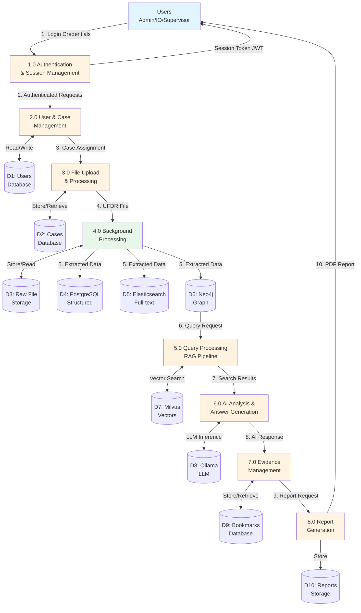
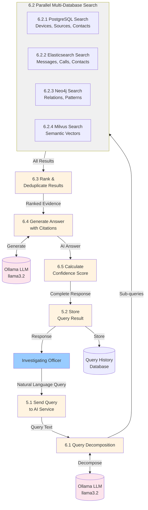

# UFDR System - Data Flow Diagram

## Level 0: Context Diagram (Mermaid)

```mermaid
graph TB
    Admin[Admin]
    IO[Investigating Officer]
    Supervisor[Supervisor]
    External[External Forensic Tools]
    
    subgraph UFDR["UFDR SYSTEM<br/>(Digital Forensic Investigation Platform)"]
        Core[Core System]
    end
    
    Admin -->|User Management<br/>Case Creation<br/>System Config| Core
    IO -->|Case Data<br/>Queries<br/>Evidence| Core
    Supervisor -->|Case Monitoring<br/>Reports<br/>Oversight| Core
    External -->|UFDR Files<br/>(XML/JSON)| Core
    
    Core -->|Dashboard<br/>Reports| Admin
    Core -->|Results<br/>Visualizations| IO
    Core -->|Analytics<br/>Reports| Supervisor
    
    style Admin fill:#ff9999
    style IO fill:#99ccff
    style Supervisor fill:#99ff99
    style External fill:#ffcc99
    style Core fill:#e8f5e9
```

## Level 1: Main System Processes (Mermaid)



## Level 2: Detailed Process Flows

### 2.1 File Upload and Processing Flow

```
┌─────────────────────────────────────────────────────────────────────┐
│              FILE UPLOAD & PROCESSING (Process 3.0 & 4.0)            │
└─────────────────────────────────────────────────────────────────────┘

┌──────────┐
│    IO    │
└─────┬────┘
      │ UFDR File (XML/JSON)
      ▼
┌─────────────────┐
│  3.1 Validate   │
│  File Format    │
└────────┬────────┘
         │ Valid File
         ▼
┌─────────────────┐         ┌──────────────┐
│  3.2 Store File │────────►│ File Storage │
│  & Create Job   │         └──────────────┘
└────────┬────────┘
         │ Job ID
         ▼
┌─────────────────┐         ┌──────────────┐
│  3.3 Queue Job  │────────►│ Redis Queue  │
│  (Bull Queue)   │         │  (Bull)      │
└─────────────────┘         └──────┬───────┘
                                   │ Job Picked
                                   ▼
                            ┌──────────────┐
                            │ 4.1 Parse    │
                            │ UFDR File    │
                            │ (XML/JSON)   │
                            └──────┬───────┘
                                   │ Raw Data
                                   ▼
                            ┌──────────────┐
                            │ 4.2 Extract  │
                            │   Entities   │
                            │    (NER)     │
                            └──────┬───────┘
                                   │ Entities
                                   ▼
                            ┌──────────────┐
                            │ 4.3 Store in │
                            │  PostgreSQL  │
                            └──────┬───────┘
                                   │
                                   ▼
                            ┌──────────────┐
                            │ 4.4 Index to │
                            │Elasticsearch │
                            └──────┬───────┘
                                   │
                                   ▼
                            ┌──────────────┐
                            │ 4.5 Build    │
                            │ Neo4j Graph  │
                            └──────┬───────┘
                                   │
                                   ▼
                            ┌──────────────┐
                            │ 4.6 Generate │
                            │  Embeddings  │
                            │  (Optional)  │
                            └──────┬───────┘
                                   │
                                   ▼
                            ┌──────────────┐
                            │ 4.7 Update   │
                            │  Job Status  │
                            └──────────────┘
```

### 2.2 Query Processing Flow (RAG Pipeline) - Mermaid



### 2.3 Report Generation Flow

```
┌─────────────────────────────────────────────────────────────────────┐
│              REPORT GENERATION (Process 8.0)                         │
└─────────────────────────────────────────────────────────────────────┘

┌──────────┐
│    IO    │
└─────┬────┘
      │ Report Request (Template + Options)
      ▼
┌─────────────────┐
│ 8.1 Validate    │
│ Report Config   │
└────────┬────────┘
         │ Valid Config
         ▼
┌─────────────────────────────────────────┐
│ 8.2 Gather Data from Multiple Sources   │
│                                          │
│  ┌────────────┐  ┌────────────┐        │
│  │ Case Info  │  │  Devices   │        │
│  │  (PG)      │  │   (PG)     │        │
│  └─────┬──────┘  └─────┬──────┘        │
│        │               │                │
│  ┌─────▼──────┐  ┌─────▼──────┐        │
│  │  Queries   │  │ Bookmarks  │        │
│  │   (PG)     │  │   (PG)     │        │
│  └─────┬──────┘  └─────┬──────┘        │
│        │               │                │
│  ┌─────▼──────┐  ┌─────▼──────┐        │
│  │ Evidence   │  │  Network   │        │
│  │   (ES)     │  │  (Neo4j)   │        │
│  └─────┬──────┘  └─────┬──────┘        │
│        │               │                │
└────────┼───────────────┼────────────────┘
         │               │
         └───────┬───────┘
                 │ Aggregated Data
                 ▼
         ┌───────────────┐
         │ 8.3 Apply     │
         │   Template    │
         │  (Full/Exec/  │
         │  Evidence)    │
         └───────┬───────┘
                 │ Formatted Data
                 ▼
         ┌───────────────┐
         │ 8.4 Generate  │
         │  PDF (PDFKit) │
         │               │
         │ • Header/Footer│
         │ • Case Info   │
         │ • Evidence    │
         │ • Timeline    │
         │ • Queries     │
         │ • Bookmarks   │
         │ • Graph       │
         └───────┬───────┘
                 │ PDF File
                 ▼
         ┌───────────────┐         ┌──────────────┐
         │ 8.5 Store     │────────►│ Report Files │
         │ Report        │         │   Storage    │
         └───────┬───────┘         └──────────────┘
                 │
                 ▼
         ┌───────────────┐         ┌──────────────┐
         │ 8.6 Save      │────────►│ Report Meta  │
         │  Metadata     │         │   Database   │
         └───────┬───────┘         └──────────────┘
                 │
                 ▼
         ┌───────────────┐         ┌──────────────┐
         │ 8.7 Log       │────────►│  Audit Log   │
         │  Generation   │         │   Database   │
         └───────┬───────┘         └──────────────┘
                 │ Download Link
                 ▼
         ┌───────────────┐
         │      IO       │
         │  (Download)   │
         └───────────────┘
```

## Data Stores

### D1: Users Database (PostgreSQL)
**Table**: `users`  
**Data**: user_id, username, password_hash, email, role, badge_number, unit, supervisor_id, is_active, created_at

### D2: Cases Database (PostgreSQL)
**Table**: `cases`  
**Data**: case_id, fir_number, title, description, status, priority, assigned_to, unit, created_by, created_at, updated_at

### D3: Raw File Storage (File System)
**Location**: `backend-node/uploads/`  
**Data**: Original UFDR XML/JSON files

### D4: PostgreSQL (Structured Data)
**Tables**: devices, data_sources, processing_jobs, case_queries, evidence_bookmarks, entity_tags, case_reports, audit_log  
**Data**: Structured forensic data, metadata, relationships

### D5: Elasticsearch (Full-text Search)
**Indices**: 
- `ufdr-messages`: SMS, WhatsApp, Telegram messages
- `ufdr-calls`: Call logs with duration, direction
- `ufdr-contacts`: Contact information  
**Data**: Searchable text content with entity highlighting

### D6: Neo4j (Graph Database)
**Nodes**: Case, Device, PhoneNumber, Contact, Entity  
**Relationships**: HAS_DEVICE, COMMUNICATED_WITH, HAS_NUMBER, LINKED_TO  
**Data**: Communication networks, relationship patterns

### D7: Milvus (Vector Database)
**Collection**: `ufdr_embeddings`  
**Data**: 384-dimensional vectors for semantic search

### D8: Ollama (LLM Models)
**Models**: 
- `nomic-embed-text`: Embedding generation
- `llama3.2`: Query processing and answer generation  
**Data**: Model weights and inference engine

### D9: Bookmarks Database (PostgreSQL)
**Table**: `evidence_bookmarks`  
**Data**: bookmark_id, case_id, user_id, evidence_type, evidence_id, notes, tags, created_at

### D10: Reports Storage (File System + Database)
**Files**: `backend-node/reports/`  
**Table**: `case_reports`  
**Data**: PDF files and metadata (report_id, case_id, template, generated_by, file_path, created_at)

## Data Flow Summary

### Input Data Flows
1. **User Credentials** → Authentication System
2. **UFDR Files (XML/JSON)** → File Upload System
3. **Natural Language Queries** → Query Processing System
4. **Report Configurations** → Report Generator

### Processing Data Flows
1. **Raw Files** → Parser → Structured Data → Multiple Databases
2. **Queries** → AI Service → Multi-DB Search → LLM → Answers
3. **Evidence** → Bookmark System → User Storage
4. **Case Data** → Report Generator → PDF Files

### Output Data Flows
1. **JWT Tokens** → User Sessions
2. **Processing Status** → User Dashboard
3. **Query Results** → User Interface (Answer + Evidence + Analysis)
4. **PDF Reports** → User Downloads
5. **Audit Logs** → Admin Dashboard

## Data Transformation Points

### T1: UFDR Parser
**Input**: XML/JSON file  
**Output**: Structured objects (messages, calls, contacts, devices)  
**Transformation**: Parse → Normalize → Validate → Structure

### T2: Entity Extractor (NER)
**Input**: Text content (messages, notes)  
**Output**: Entities (phone numbers, emails, IDs, URLs, crypto addresses)  
**Transformation**: Regex patterns → Classification → Validation

### T3: Elasticsearch Indexer
**Input**: Structured objects  
**Output**: Searchable documents with mappings  
**Transformation**: Map fields → Tokenize → Index

### T4: Neo4j Graph Builder
**Input**: Structured objects with relationships  
**Output**: Graph nodes and edges  
**Transformation**: Identify entities → Create nodes → Create relationships

### T5: Embedding Generator
**Input**: Text content  
**Output**: 384-dimensional vectors  
**Transformation**: Tokenize → Ollama embedding model → Vector

### T6: Query Decomposer
**Input**: Natural language query  
**Output**: Structured sub-queries  
**Transformation**: LLM analysis → Intent extraction → Query generation

### T7: Answer Synthesizer
**Input**: Ranked evidence + Query  
**Output**: Natural language answer with citations  
**Transformation**: Context assembly → LLM generation → Citation linking

### T8: Report Compiler
**Input**: Case data from multiple sources  
**Output**: PDF document  
**Transformation**: Data aggregation → Template application → PDF rendering

## Data Security & Privacy

### Encryption
- **In Transit**: HTTPS/TLS for all API communications
- **At Rest**: Database encryption for sensitive fields
- **Passwords**: Bcrypt hashing (10 rounds)
- **Tokens**: JWT with secure signing

### Access Control
- **RBAC**: Role-based access at API level
- **Row-Level Security**: Users see only assigned cases
- **Audit Trail**: All data access logged
- **Session Management**: Token expiration and refresh

### Data Isolation
- **Multi-tenancy**: Cases isolated by assignment
- **User Isolation**: IOs see only their cases
- **Supervisor Scope**: Limited to unit/team
- **Admin Override**: Full access with audit logging

## Performance Considerations

### Caching
- **Redis**: Session cache, job queue
- **Application**: Query result caching (short-term)

### Async Processing
- **Bull Queue**: File processing, indexing, embedding generation
- **Non-blocking**: User doesn't wait for processing

### Database Optimization
- **PostgreSQL**: Indexes on foreign keys, search fields
- **Elasticsearch**: Optimized mappings, sharding
- **Neo4j**: Graph indexes on node properties
- **Milvus**: HNSW index for vector search

### Parallel Processing
- **RAG Pipeline**: Parallel database searches
- **Background Workers**: Multiple concurrent jobs
- **Batch Operations**: Bulk indexing, embedding generation
