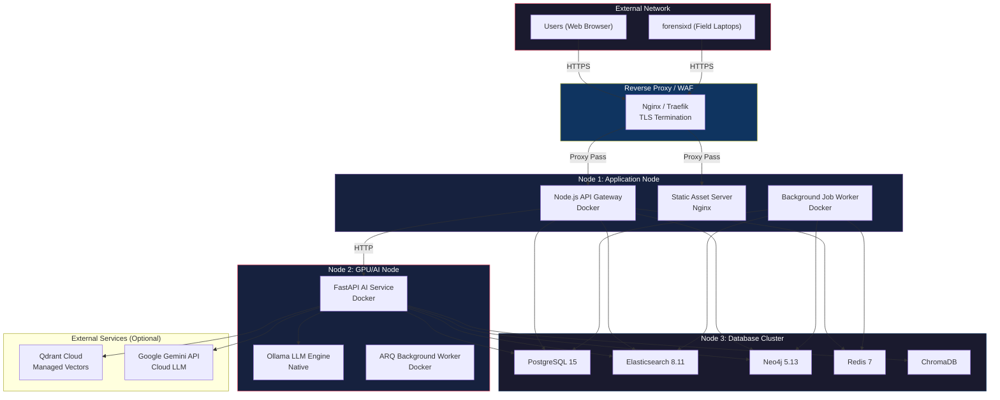

# CopSight AI — Production Deployment Guide

This guide outlines the recommended architecture and steps for deploying CopSight AI in a production environment. Given the sensitive nature of forensic data, security, isolation, and resilience are paramount.

---

## 🏗️ Production Architecture

For production, we recommend deploying across at least three separate nodes (or VM instances) to isolate workloads, specifically moving heavy ML inference off the API gateway.



---

## 📋 Infrastructure Requirements

### Node 1: Application (API + Frontend)
- **CPU:** 4 vCPUs
- **RAM:** 8 GB
- **Storage:** 50 GB SSD (for uploaded UFDR files before parsing)

### Node 2: AI & Inference (Heavy Workload)
- **CPU:** 8+ vCPUs
- **RAM:** 16-32 GB
- **GPU:** NVIDIA GPU with 8GB+ VRAM (Highly Recommended for Ollama & PyTorch)
- **Storage:** 100 GB SSD (for model weights)

### Node 3: Databases
- **CPU:** 8 vCPUs
- **RAM:** 16-32 GB (Elasticsearch is memory intensive)
- **Storage:** 500 GB+ NVMe SSD (forensic data grows rapidly)

---

## 🛠️ Step 1: Database Setup

1. Copy `docker-compose.yml` to the Database Node.
2. Ensure you change default passwords before starting:
   ```yaml
   # Update in docker-compose.yml
   POSTGRES_PASSWORD: secure_password_here
   NEO4J_AUTH: neo4j/secure_password_here
   ```
3. Start the cluster:
   ```bash
   docker-compose up -d postgresql elasticsearch redis neo4j chroma
   ```
4. Verify all containers are healthy.

---

## 🧠 Step 2: AI Node Setup

1. Install Ollama natively to fully utilize GPU resources:
   ```bash
   curl -fsSL https://ollama.com/install.sh | sh
   ```
2. Pull required models:
   ```bash
   ollama pull nomic-embed-text
   ollama pull llama3.2
   ```
3. Configure Ollama to listen on external interfaces (if separated from AI Service container):
   ```bash
   echo 'Environment="OLLAMA_HOST=0.0.0.0"' >> /etc/systemd/system/ollama.service
   systemctl daemon-reload && systemctl restart ollama
   ```
4. Start AI Service:
   ```bash
   cd ai-service
   cp .env.example .env
   # Edit .env with correct Database IP addresses
   # Edit .env: ENVIRONMENT=production
   pip install -r requirements.txt
   uvicorn app.main:app --host 0.0.0.0 --port 8005 --workers 4
   ```

---

## 🌐 Step 3: Application Node Setup

1. Build Frontend:
   ```bash
   cd frontend
   npm install
   # Create .env.production with VITE_API_URL=https://yourdomain.com/api
   npm run build
   # Serve the /dist folder using Nginx
   ```

2. Start Backend:
   ```bash
   cd backend-node
   npm install
   cp .env.example .env
   # Edit .env: DB_HOST, REDIS_HOST, ELASTICSEARCH_URL, etc.
   # Edit .env: AI_SERVICE_URL=http://<AI_NODE_IP>:8005
   # Edit .env: NODE_ENV=production
   
   # Use PM2 for process management
   npm install -g pm2
   pm2 start src/server.js --name "copsight-api"
   pm2 start src/workers/processingWorker.js --name "copsight-worker"
   pm2 save
   ```

---

## 🔒 Security Best Practices

### 1. Reverse Proxy (Nginx)

Always place CopSight AI behind a reverse proxy handling TLS termination. Never expose Node.js or FastAPI directly to the internet.

```nginx
server {
    listen 443 ssl;
    server_name copsight.agency.gov;
    
    # SSL config...
    
    # Frontend
    location / {
        root /var/www/copsight/frontend/dist;
        try_files $uri $uri/ /index.html;
    }
    
    # Backend API
    location /api/ {
        proxy_pass http://localhost:8080/api/;
        proxy_set_header Host $host;
        proxy_set_header X-Real-IP $remote_addr;
        
        # Required for large UFDR uploads
        client_max_body_size 5G; 
    }
}
```

### 2. Network Isolation
- **Databases** should only accept connections from the Application and AI nodes.
- **AI Service** should only accept connections from the Application node.
- Only the **Reverse Proxy** should expose ports 80/443 to the end-users.

---

## 📦 Forensixd Executable Builds

To deploy the `forensixd` extraction tool to field officers, you must compile it into standalone executables.

The project includes a GitHub Actions CI pipeline (`.github/workflows/build.yml`) that automatically builds `.exe`, macOS, and Linux binaries.

### Manual Local Build (PyInstaller)

If you need to build it manually:

```bash
cd forensixd
pip install pyinstaller

# Build for current OS
pyinstaller forensixd.spec --noconfirm

# Output will be in dist/forensixd/
```

> [!IMPORTANT]
> **Production Injection:** Ensure you inject your production server URLs into `forensixd/constants.py` before building, so the CLI knows where to stream extracted evidence.

---

## ☁️ Hosted Deployments (e.g., Render)

If deploying the backend to a managed cloud provider like Render, be aware of idle timeouts. The AI Service includes a built-in **Stealth Keep-Alive System** (`main.py:97`) that periodically pings the Node.js backend and Qdrant to prevent the services from spinning down during inactive periods.

Set `QDRANT_URL` and `QDRANT_API_KEY` in your AI Service `.env` if using Qdrant Cloud.
