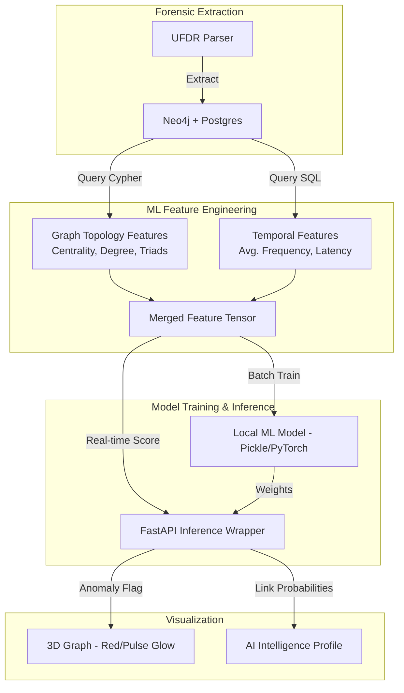
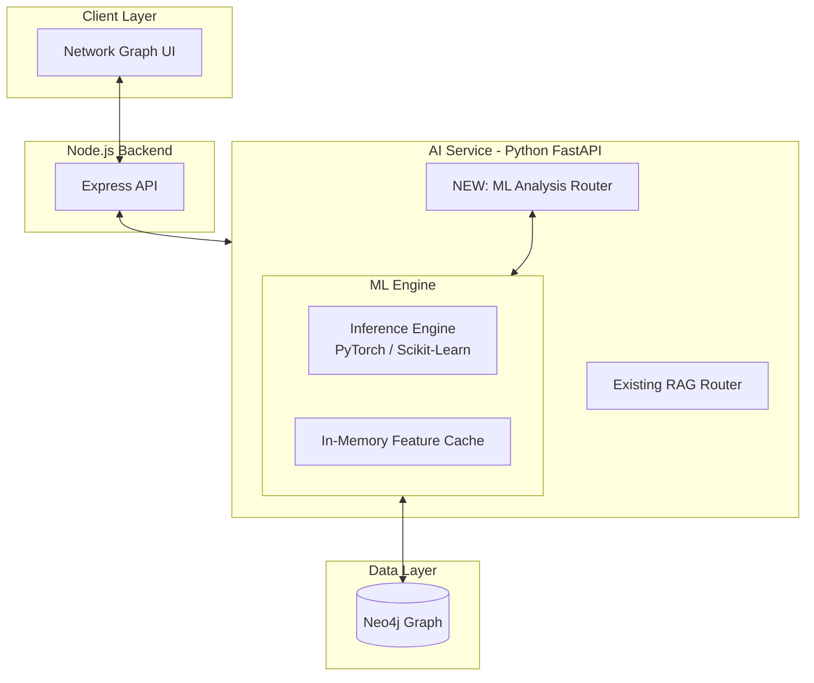

# Forensic ML Blueprint: Anomaly & Predictive Analysis

This document outlines the structured use case, data flow, and architecture for implementing machine learning models within the UFDR platform, specifically targeting forensic anomaly detection and predictive relationship analysis.

---

## 1. Structured Use Cases

### 1.1 Anomaly Detection: "The Ghost Entity"
**Objective**: Identify entities or transaction patterns that deviate from normal forensic baselines.
- **Input Data**: Neo4j relationships (`COMMUNICATED_WITH`, `LINKED_TO`), Call density, Transaction volumes.
- **Anomalies Targeted**:
    - **Circular Flows**: Money/Messages traveling in complete closed loops (Money Laundering).
    - **Burst Communication**: 500+ calls/messages within a 1-hour window to a single unverified CID.
    - **Hardware Overlap**: One IMEI/Device ID associated with 20+ distinct SIM/PhoneNumbers.
- **Model Recommendation**: 
    - **Isolation Forest**: Unsupervised approach to identify outliers in communication frequency and node degree.
    - **Autoencoders**: To learn "normal" communication embeddings and flag high-reconstruction error nodes.

### 1.2 Predictive Analysis: "Hidden Link Prediction"
**Objective**: Predict relationships between two entities that have no direct observed communication but are statistically likely to be connected.
- **Input Data**: Node labels (Person, Device), Shared neighbors (Jaccard Similarity), Graph embeddings.
- **Predictions Targeted**:
    - **Common Accomplice**: Predicting that Suspect A and Suspect B are linked via a common "middle-man" node.
    - **Next Step Forecasting**: Predicting the next high-probability wallet transfer based on historical temporal patterns.
- **Model Recommendation**:
    - **Graph Neural Networks (GNNs)**: Using `GraphSage` or `Node2Vec` to generate entity embeddings that represent their topological context.

---

## 2. Augmented Data Flow Diagram (DFD)

---

## 3. System Architecture

The following diagram illustrates how the new **ML Inference Engine** integrates into your existing **FastAPI (AI Service)** layer without breaking current RAG functionality.

---

## 4. Implementation Checklist for Model Training

To begin training, follow these technical steps:
1.  `[ ]` **Data Export**: Execute `MATCH (n)-[r]->(m) RETURN n.id, m.id, type(r)` from Neo4j to build your adjacency list.
2.  `[ ]` **Embedding Generation**: Use `Node2Vec` or `PyTorch Geometric` to convert your Neo4j topology into numeric vectors.
3.  `[ ]` **Labeling**: Manually tag "High Risk" vs "Low Risk" samples in your existing cases (Supervised) or use Clustering (Unsupervised).
4.  `[ ]` **Model Hook**: Add a new POST endpoint `/api/analysis/predict` in `ai-service/app/routers/analysis.py`.

---

> [!TIP]
> **Performance Note:** When running GNNs on your Mac, utilize `torch.device('mps')` to leverage the **Metal Performance Shaders (Apple Silicon GPU)** for up to 10x faster training than CPU.
