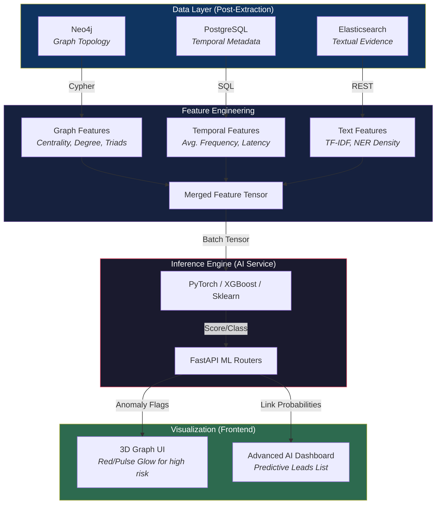
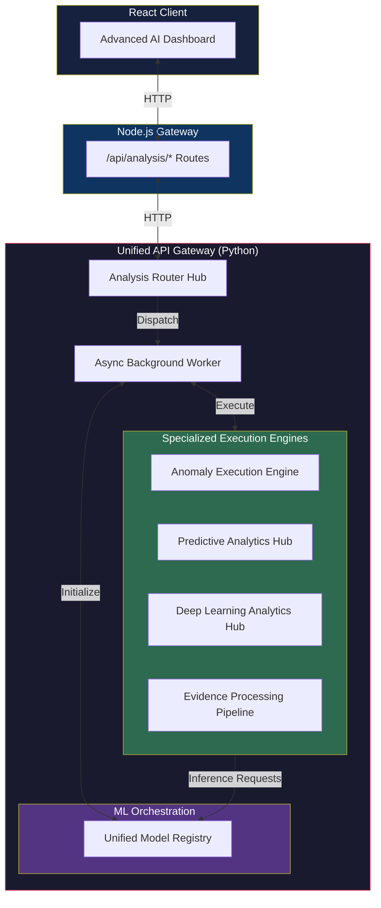

# Forensic ML Blueprint: Anomaly & Predictive Analysis

This document outlines the machine learning models and pipelines implemented within the CopSight AI platform, specifically targeting forensic anomaly detection, predictive relationship analysis, and evidence classification.

---

## 1. Implemented ML Models & Use Cases

CopSight AI has moved beyond concept into implementation. The following models are currently active in the `ai-service/app/services/` layer:

### 1.1 Anomaly Detection: "The Ghost Entity"
**Objective**: Identify entities or transaction patterns that deviate from normal forensic baselines.
- **Input Data**: Neo4j relationships (`COMMUNICATED_WITH`, `LINKED_TO`), Call density, Transaction volumes.
- **Anomalies Targeted**:
    - **Circular Flows**: Money/Messages traveling in complete closed loops (Money Laundering).
    - **Burst Communication**: 500+ calls/messages within a 1-hour window to a single unverified CID.
    - **Hardware Overlap**: One IMEI/Device ID associated with 20+ distinct SIM/PhoneNumbers.
- **Implemented Models** (`anomaly_detector.py`): 
    - **Isolation Forest**: Unsupervised approach to identify outliers in communication frequency and node degree.
    - **Autoencoders**: PyTorch-based neural networks learning "normal" communication embeddings and flagging high-reconstruction error nodes.

### 1.2 Predictive Analysis: "Hidden Link Prediction"
**Objective**: Predict relationships between two entities that have no direct observed communication but are statistically likely to be connected.
- **Input Data**: Node labels (Person, Device), Shared neighbors (Jaccard Similarity), Graph embeddings.
- **Predictions Targeted**:
    - **Common Accomplice**: Predicting that Suspect A and Suspect B are linked via a common "middle-man" node.
    - **Next Step Forecasting**: Predicting the next high-probability wallet transfer based on historical temporal patterns.
- **Implemented Models** (`predictive_analytics.py`):
    - **Graph Neural Networks (GNNs)**: Generating entity embeddings that represent their topological context.
    - **Risk Scoring Engine**: Heuristic + ML composite scoring for investigation leads.

### 1.3 Deep Learning Temporal Analysis
**Objective**: Analyze sequential events to detect organized activities.
- **Implemented Models** (`deep_learning_analyzer.py`):
    - **LSTM (Long Short-Term Memory)**: Analyzing time-series communication data to detect coordinated operational phases (planning, execution, cleanup).

### 1.4 Evidence Classification
**Objective**: Automatically categorize raw extracted text and artifacts.
- **Implemented Models** (`evidence_classifier.py`):
    - **XGBoost Classifiers**: High-performance gradient boosting to categorize evidence artifacts based on textual features and metadata.

---

## 2. ML Data Flow Architecture

The ML pipeline operates asynchronously via the ARQ background worker, pulling data from the multi-database architecture.

---

## 3. ML Orchestration & Execution Architecture

The ML Inference Engine is fully integrated into the existing FastAPI Unified API Gateway, sitting alongside the RAG capabilities. It employs a highly decoupled architecture separating model management from inference execution.

### 3.1 Separation of Concerns
- **Unified Model Registry**: Acts as the central model management hub. It coordinates the loading of multi-format ML assets (e.g., PyTorch state dicts, XGBoost boosters) into memory to avoid redundant I/O. It provides a standardized interface for execution engines to access the models.
- **Execution Engines**: Specialized engines (e.g., the Anomaly Execution Engine or Deep Learning Analytics Hub) do not manage models directly. Instead, they handle data preprocessing, feature engineering, and delegate inference execution to the registry's loaded models.

---

## 4. Hardware Acceleration

The AI Service is configured to leverage hardware acceleration automatically when available:

> [!TIP]
> **Performance Note:** When running Deep Learning (PyTorch) models, the `deep_learning_analyzer.py` will automatically attempt to use `torch.device('cuda')` on NVIDIA GPUs or `torch.device('mps')` to leverage the **Metal Performance Shaders (Apple Silicon GPU)**, providing up to 10x faster training and inference than CPU.

---

## 5. Implementation Status

- `[x]` **Data Export pipelines**: SQLAlchemy and AsyncNeo4j drivers implemented in `database.py`.
- `[x]` **Embedding Generation**: Integrated `nomic-embed-text` via Ollama and `SentenceTransformers`.
- `[x]` **Model Hooks**: Implemented comprehensive REST API in `routers/analysis.py` (e.g., `/api/analysis/anomalies`, `/api/analysis/predictive-analysis`).
- `[x]` **Background Execution**: ARQ worker implemented to prevent long-running inference tasks from blocking the API gateway.
- `[x]` **Vector Storage**: ChromaDB / Qdrant implemented for semantic similarity clustering.
