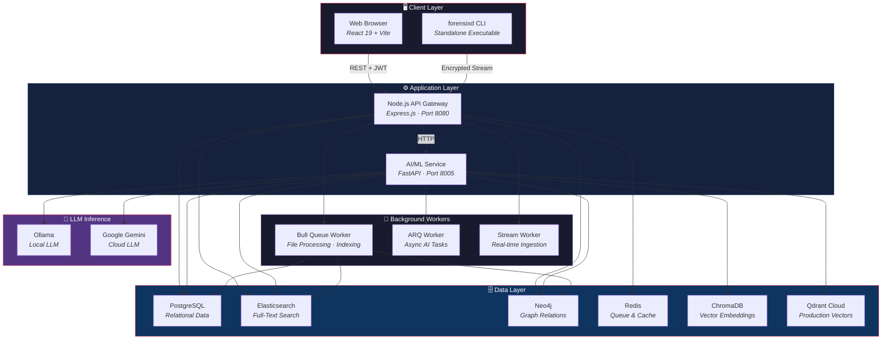
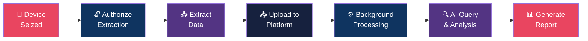
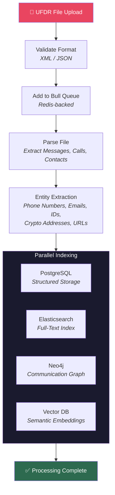
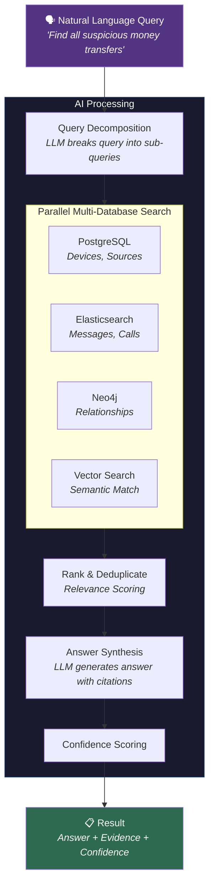
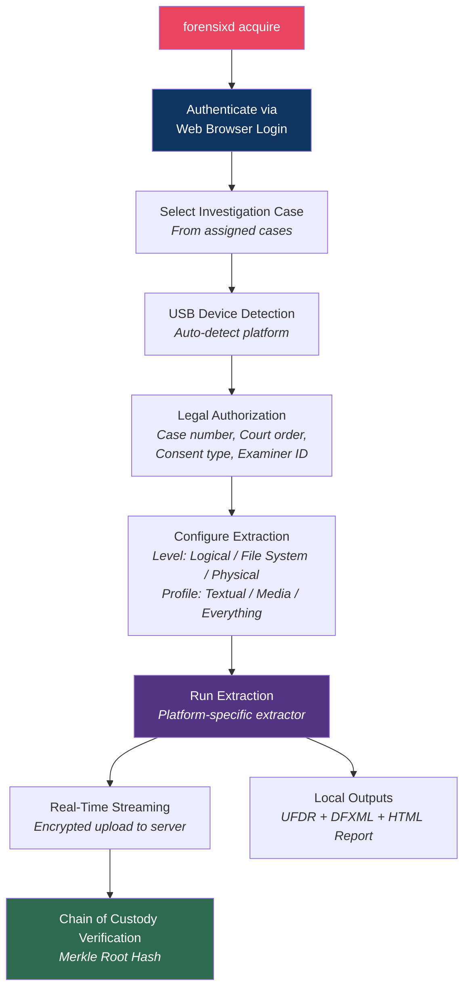
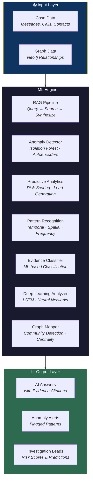
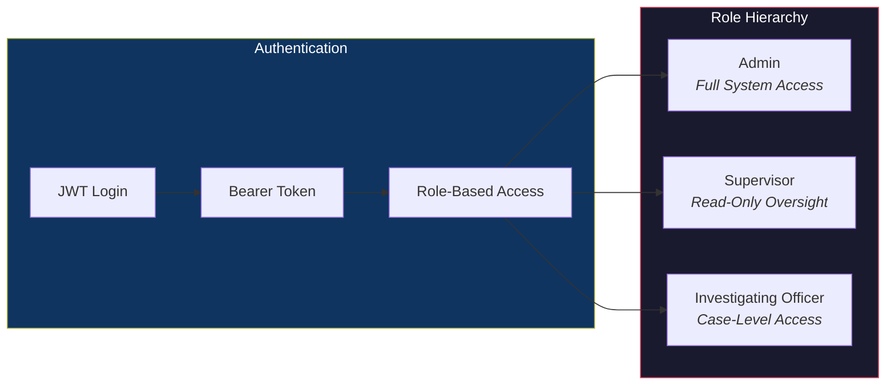

<p align="center">
  
</p>

<h1 align="center">CopSight AI</h1>
<p align="center"><strong>Universal Forensic Data Analysis Platform for Law Enforcement</strong></p>

<p align="center">
  
  
  
  
  
</p>

---

CopSight AI is an end-to-end digital forensics platform that enables law enforcement agencies to **extract**, **analyze**, and **investigate** mobile device data using AI-powered natural language queries, anomaly detection, and interactive visualizations. The platform covers the complete forensic lifecycle — from physical device acquisition to court-ready PDF reports.

## Table of Contents

- [Key Capabilities](#-key-capabilities)
- [Platform Architecture](#-platform-architecture)
- [How It Works](#-how-it-works)
- [Forensixd — Device Extraction Engine](#-forensixd--device-extraction-engine)
- [AI & Machine Learning Pipeline](#-ai--machine-learning-pipeline)
- [Technology Stack](#-technology-stack)
- [Getting Started](#-getting-started)
- [Configuration Reference](#-configuration-reference)
- [API Overview](#-api-overview)
- [Security & Compliance](#-security--compliance)
- [Project Structure](#-project-structure)
- [Troubleshooting](#-troubleshooting)
- [Contributing](#-contributing)

---

## 🎯 Key Capabilities

### Investigation Workflow
- **Multi-Role Access Control** — Admin, Investigating Officer, and Supervisor roles with case-level permissions
- **Case Management** — Create, assign, track, and review investigation cases with priority and status workflows
- **Evidence Upload** — Process UFDR/XML/JSON forensic data files with automated background parsing

### AI-Powered Analysis
- **Natural Language Queries** — Ask questions like _"Show all communications with foreign numbers"_ and receive AI-generated answers with evidence citations
- **RAG Pipeline** — Retrieval-Augmented Generation that searches across PostgreSQL, Elasticsearch, Neo4j, and vector databases simultaneously
- **Anomaly Detection** — ML-based identification of suspicious communication patterns, burst activity, and circular financial flows
- **Predictive Analytics** — Risk scoring, hidden link prediction, and investigation lead generation
- **Pattern Recognition** — Temporal, spatial, and frequency-based pattern discovery across forensic datasets

### Visualization & Reporting
- **Interactive Network Graphs** — Explore communication networks with zoom, pan, and node filtering
- **Timeline Analysis** — Chronological event visualization with category filtering
- **Cross-Case Intelligence** — Discover shared entities and connections across multiple investigations
- **PDF Report Generation** — Professional court-ready reports with customizable templates

### Forensic Device Extraction
- **Standalone CLI Tool** — `forensixd` command-line tool for direct device acquisition
- **Multi-Platform Support** — Android (ADB), iOS (pymobiledevice3), Windows, and disk image extraction
- **App-Level Parsing** — WhatsApp, Telegram, iMessage, Signal, browsers, call logs, email
- **Chain of Custody** — Cryptographic hashing (MD5 + SHA-256) with Merkle root verification
- **Legal Compliance** — Built-in court order reference, consent tracking, and authorization management

---

## 🏗️ Platform Architecture



### Architecture Principles

| Principle | Implementation |
|-----------|----------------|
| **Separation of Concerns** | Each service handles a single domain — API routing, AI processing, device extraction |
| **Multi-Database Strategy** | Right database for the right job — relational, search, graph, and vector stores |
| **Privacy-First AI** | All AI inference runs on-premise via Ollama; no data leaves the network |
| **Background Processing** | File parsing, indexing, and AI analysis run asynchronously via job queues |
| **Chain of Custody** | Every data extraction is cryptographically hashed and audit-logged |

---

## 🔄 How It Works

### End-to-End Investigation Flow



### Data Processing Pipeline

When a forensic data file is uploaded, the platform executes a multi-stage processing pipeline:



### RAG Query Pipeline

Natural language queries are processed through a multi-stage Retrieval-Augmented Generation pipeline:



---

## 🔧 Forensixd — Device Extraction Engine

`forensixd` is a standalone command-line tool that performs forensic data acquisition directly from connected devices. It can be compiled into a portable executable (`.exe` / binary) that requires no host-system dependencies.

### Extraction Flow



### Supported Platforms & Parsers

| Platform | Connection | Extraction Levels | Key Capabilities |
|----------|------------|-------------------|-----------------|
| **Android** | ADB (USB/WiFi) | Logical, File System | SMS, Call Logs, WhatsApp, Telegram, Signal, Browser History, Contacts |
| **iOS** | pymobiledevice3 (USB) | Logical, File System | iMessage, WhatsApp, Call Logs, Contacts, Safari History, Photos |
| **Windows** | Direct / Image | Logical, File System, Physical | Registry, Browser Data, Email, System Logs |
| **Disk Image** | E01/DD/Raw | File System, Physical | Full filesystem traversal, deleted file recovery |

### Application Parsers

| Application | Parser | Data Extracted |
|------------|--------|---------------|
| **WhatsApp** | `whatsapp.py` | Messages, media metadata, group info, contacts |
| **Telegram** | `telegram.py` | Messages, channels, contacts |
| **iMessage** | `imessage.py` | Messages, attachments, read receipts |
| **Signal** | `signal.py` | Messages, disappearing message status |
| **Browsers** | `browsers.py` | History, bookmarks, downloads, cookies |
| **Call Logs** | `call_log.py` | Calls with duration, direction, timestamps |
| **Email** | `email_parser.py` | Emails with headers, body, attachments |

### Output Formats

| Format | File | Purpose |
|--------|------|---------|
| **UFDR** | `{session_id}.ufdr` | Universal Forensic Data Reader format for interoperability |
| **DFXML** | `acquisition.dfxml` | Digital Forensics XML for chain-of-custody documentation |
| **HTML Report** | `report.html` | Human-readable acquisition summary with evidence tables |
| **API Stream** | Real-time | Encrypted streaming of artifacts to the web platform |

---

## 🧠 AI & Machine Learning Pipeline

The AI service is a full ML platform with multiple analysis engines that work together:



### Anomaly Detection Capabilities

| Anomaly Type | Detection Method | Example |
|-------------|-----------------|---------|
| **Circular Flows** | Graph cycle detection | Money/messages in closed loops indicating laundering |
| **Burst Communication** | Temporal frequency analysis | 500+ messages to unverified number in 1 hour |
| **Hardware Overlap** | Device-SIM correlation | One IMEI with 20+ distinct SIM cards |
| **Behavioral Deviation** | Isolation Forest / Autoencoders | Communication pattern deviating from baseline |
| **Network Anomalies** | Graph centrality analysis | Unusual betweenness centrality in communication graph |

---

## 🛠️ Technology Stack

### Frontend
| Technology | Purpose |
|-----------|---------|
| React 19 + TypeScript | UI framework with type safety |
| Vite | Build tooling and dev server |
| TailwindCSS | Utility-first styling |
| Zustand | Lightweight state management |
| D3.js / react-force-graph | Interactive network visualizations |
| Axios | HTTP client for API communication |
| React Router v6 | Client-side routing |
| Lucide React | Icon library |

### Backend API
| Technology | Purpose |
|-----------|---------|
| Node.js 18+ / Express.js | REST API framework |
| Sequelize | ORM for PostgreSQL |
| Bull Queue (Redis) | Background job processing |
| JWT + bcrypt | Authentication and password hashing |
| Multer | File upload handling |
| Winston | Structured logging |
| Helmet + CORS | Security middleware |
| PDFKit | PDF report generation |

### AI/ML Service
| Technology | Purpose |
|-----------|---------|
| FastAPI (Python) | Async API framework |
| Ollama / Gemini | LLM inference (local or cloud) |
| XGBoost | Gradient boosting for classification |
| PyTorch | Deep learning models (LSTM, Autoencoders) |
| scikit-learn | Classical ML algorithms |
| ChromaDB / Qdrant | Vector storage and semantic search |
| ARQ | Async task queue for background AI work |
| Loguru | Structured logging |

### Forensixd CLI
| Technology | Purpose |
|-----------|---------|
| Click | CLI framework |
| Rich | Terminal UI (tables, progress bars, panels) |
| Pydantic v2 | Data validation and models |
| adb-shell | Android device communication |
| pymobiledevice3 | iOS device communication |
| PyCryptodome | Cryptographic hashing |
| PyInstaller | Cross-platform executable builds |

### Databases
| Database | Port | Purpose |
|----------|------|---------|
| PostgreSQL 15 | 5433 | Primary relational storage (users, cases, devices, evidence) |
| Elasticsearch 8.11 | 9201 | Full-text search across messages, calls, contacts |
| Neo4j 5.13 | 7688 | Communication network graph and relationship mapping |
| Redis 7 | 6380 | Job queue, session cache, rate limiting |
| ChromaDB | 8006 | Vector embeddings for semantic search (development) |
| Qdrant Cloud | — | Production vector search with managed infrastructure |

---

## 🚀 Getting Started

### Prerequisites

| Requirement | Version | Required |
|------------|---------|----------|
| Docker Desktop | Latest | ✅ Yes |
| Node.js | 18+ | ✅ Yes |
| Python | 3.11+ | ✅ For AI features |
| Git | Latest | ✅ Yes |
| Ollama | Latest | Optional (for local LLM) |

### Step 1 — Start Database Services

```bash
git clone https://github.com/beingbrijesh/CopSight
cd CopSight

# Start all databases (PostgreSQL, Elasticsearch, Neo4j, Redis, ChromaDB)
./START-ALL.sh

# Wait ~30 seconds for services to initialize
```

### Step 2 — Start the Backend

```bash
cd backend-node
npm install
cp .env.example .env    # Configure if needed (defaults work locally)
npm run dev             # → http://localhost:8080
```

### Step 3 — Start the Frontend

```bash
cd frontend
npm install
npm run dev             # → http://localhost:5173
```

### Step 4 — Start the AI Service (Optional)

```bash
cd ai-service
python3 -m venv venv
source venv/bin/activate
pip install -r requirements.txt
cp .env.example .env
uvicorn app.main:app --reload --port 8005   # → http://localhost:8005
```

### Step 5 — Install LLM Models (Optional)

```bash
# Install Ollama from https://ollama.com
ollama pull nomic-embed-text    # Embedding model (274 MB)
ollama pull llama3.2            # Query model (2 GB)
```

### Default Login

| Field | Value |
|-------|-------|
| **URL** | http://localhost:5173 |
| **Username** | `admin` |
| **Password** | `admin123` |

---

## ⚙️ Configuration Reference

### Backend Environment (`.env`)

```env
PORT=8080
NODE_ENV=development
JWT_SECRET=your-secret-key
DB_HOST=localhost
DB_PORT=5433
ELASTICSEARCH_URL=http://localhost:9201
NEO4J_URI=bolt://localhost:7688
REDIS_HOST=localhost
REDIS_PORT=6380
AI_SERVICE_URL=http://localhost:8005
```

### AI Service Environment (`.env`)

```env
POSTGRES_HOST=localhost
POSTGRES_PORT=5433
ELASTICSEARCH_URL=http://localhost:9201
NEO4J_URI=bolt://localhost:7688
OLLAMA_HOST=http://localhost:11434
EMBEDDING_MODEL=nomic-embed-text
LLM_MODEL=llama3.2
GEMINI_API_KEY=                  # Optional: Enable Google Gemini
QDRANT_URL=http://localhost:6333 # Optional: Production vector DB
```

See [OLLAMA-SETUP.md](OLLAMA-SETUP.md) for detailed LLM configuration.

---

## 📡 API Overview

The platform exposes a comprehensive REST API organized by domain:

| Domain | Route Prefix | Key Operations |
|--------|-------------|----------------|
| **Authentication** | `/api/auth` | Login, logout, session management, password change |
| **Users** | `/api/users` | CRUD, role assignment, officer/supervisor listings |
| **Cases** | `/api/cases` | Create, assign, track, review cases with status workflow |
| **Upload** | `/api/upload` | UFDR file upload, job status tracking, processing summary |
| **Query** | `/api/query` | Natural language queries with AI-generated answers |
| **Bookmarks** | `/api/bookmarks` | Save, annotate, tag, and reorder evidence bookmarks |
| **Reports** | `/api/reports` | Generate PDF reports, view history, list templates |
| **Cross-Case** | `/api/cross-case` | Search across cases, find shared entities, create case links |
| **Alerts** | `/api/alerts` | Manage alerts and alert rules |
| **Graph** | `/api/graph` | Communication network queries, neighbor traversal |
| **Analysis** | `/api/analysis` | Anomaly detection, predictive analytics, deep learning |
| **Ingestion** | `/api/ingest` | Direct data ingestion endpoints |
| **Notifications** | `/api/notifications` | User notifications and read status |
| **Integration** | `/api/integration` | Webhooks, bulk operations, external evidence |
| **Performance** | `/api/performance` | System metrics, health checks, monitoring |

Full API documentation: [API-DOCS.md](API-DOCS.md)

---

## 🔐 Security & Compliance

### Authentication & Access Control



| Feature | Implementation |
|---------|---------------|
| **Authentication** | JWT tokens with configurable expiration |
| **Password Security** | bcrypt hashing (12 rounds) |
| **Access Control** | RBAC with 3 roles + case-level access middleware |
| **Session Management** | Database-persisted sessions with token validation |
| **API Security** | Helmet headers, CORS, rate limiting (auth/search/upload/AI) |
| **Input Protection** | Sequelize ORM (SQL injection), input sanitization (XSS) |
| **Audit Trail** | Every action logged with user, timestamp, and IP |
| **On-Premise AI** | All LLM inference runs locally — no data leaves the network |
| **Chain of Custody** | MD5 + SHA-256 hashing with Merkle root verification |
| **Legal Compliance** | Court order references, consent type tracking, examiner identification |

---

## 📁 Project Structure

```
CopSight/
├── frontend/                         # React 19 + TypeScript + Vite
│   └── src/
│       ├── pages/                    # Login, Admin, IO, Supervisor views
│       ├── components/               # Shared UI components
│       ├── store/                    # Zustand state management
│       └── lib/                      # API client (Axios)
│
├── backend-node/                     # Node.js + Express API Gateway
│   └── src/
│       ├── routes/                   # REST API route definitions
│       ├── controllers/              # Request handlers
│       ├── models/                   # Sequelize ORM models
│       ├── services/                 # Business logic (parser, NER, search, graph, AI, reports)
│       ├── middleware/               # Auth, RBAC, rate limiting, upload
│       ├── workers/                  # Background job processors
│       └── queues/                   # Bull queue configuration
│
├── ai-service/                       # Python + FastAPI AI/ML Service
│   └── app/
│       ├── routers/                  # API endpoints (query, embeddings, analysis, indexing, ingestion)
│       ├── services/                 # ML engines (RAG, anomaly, predictive, pattern, evidence, deep learning)
│       ├── plugins/                  # Extensible plugin architecture
│       └── worker.py                 # ARQ background worker
│
├── forensixd/                        # Standalone Forensic Extraction CLI
│   ├── cli.py                        # Click CLI with interactive shell
│   ├── core/                         # Session management, models, hashing, auth, device detection
│   ├── extractors/                   # Platform extractors (Android, iOS, Windows, Disk Image)
│   ├── parsers/                      # Data parsers (SQLite, plist, registry)
│   │   └── apps/                     # App parsers (WhatsApp, Telegram, iMessage, Signal, etc.)
│   ├── writers/                      # Output writers (UFDR, DFXML, HTML Report, API Stream)
│   ├── legal/                        # Authorization manager, chain of custody
│   └── integration/                  # UFDR bridge for platform integration
│
├── tests/                            # Test suites (pytest)
│   ├── test_core/                    # Core module tests
│   ├── test_extractors/              # Extractor tests
│   ├── test_parsers/                 # Parser tests
│   ├── test_legal/                   # Legal compliance tests
│   ├── test_writers/                 # Writer tests
│   └── test_integration/            # Integration tests
│
├── .github/workflows/                # CI/CD (GitHub Actions)
│   └── build.yml                     # Cross-platform PyInstaller builds
│
├── docker-compose.yml                # Database services orchestration
├── START-ALL.sh                      # One-command database startup
├── pyproject.toml                    # Python project configuration
└── forensixd.spec                    # PyInstaller build specification
```

---

## 🐛 Troubleshooting

<details>
<summary><strong>Backend won't start</strong></summary>

```bash
# Check if port is in use
lsof -ti:8080

# Kill process and restart
kill -9 $(lsof -ti:8080)
cd backend-node && npm run dev
```
</details>

<details>
<summary><strong>Database connection error</strong></summary>

```bash
docker ps                   # Check running containers
docker-compose restart      # Restart all databases
docker logs copsight-postgres   # Check specific service logs
```
</details>

<details>
<summary><strong>AI Service not working</strong></summary>

```bash
# Verify Ollama is running
curl http://localhost:11434/api/tags

# Re-pull models if needed
ollama pull nomic-embed-text
ollama pull llama3.2
```
</details>

<details>
<summary><strong>Frontend build error</strong></summary>

```bash
cd frontend
rm -rf node_modules package-lock.json
npm install
npm run dev
```
</details>

<details>
<summary><strong>Reset admin password</strong></summary>

```bash
cd backend-node
node scripts/reset-admin.js    # Resets to admin123
```
</details>

---

## 🤝 Contributing

See [CONTRIBUTING.md](CONTRIBUTING.md) for development setup, code standards, and pull request guidelines.

### Quick Development Setup

```bash
# Install Python dev dependencies (linting, testing, building)
pip install -e .[dev]

# Install Git hooks (runs linters on commit, builds on push)
pre-commit install
pre-commit install -t pre-push
```

---

## 📚 Additional Documentation

| Document | Description |
|----------|-------------|
| [ARCHITECTURE-DIAGRAM.md](ARCHITECTURE-DIAGRAM.md) | Detailed system architecture with component breakdowns |
| [DATA-FLOW-DIAGRAM.md](DATA-FLOW-DIAGRAM.md) | Complete data flow diagrams for all major processes |
| [USE-CASE-DIAGRAM.md](USE-CASE-DIAGRAM.md) | Actor-use case mappings and detailed workflows |
| [API-DOCS.md](API-DOCS.md) | Comprehensive API reference |
| [DEPLOYMENT.md](DEPLOYMENT.md) | Production deployment guide |
| [QUICK-START.md](QUICK-START.md) | 5-minute setup guide |
| [OLLAMA-SETUP.md](OLLAMA-SETUP.md) | LLM installation and configuration |
| [FORENSIC_ML_BLUEPRINT.md](FORENSIC_ML_BLUEPRINT.md) | ML model architecture and training guide |

---

<p align="center">
  <strong>CopSight AI</strong> — Built for Law Enforcement. Powered by AI.<br/>
  <sub>MIT License · Production Ready</sub>
</p>
