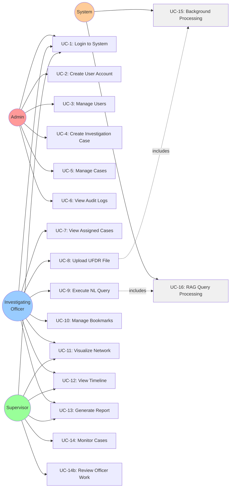

# UFDR System - Use Case Diagram

## Actors
- **Admin**: System administrator with full access
- **Investigating Officer (IO)**: Primary case investigator
- **Supervisor**: Oversees multiple cases and officers
- **System**: Automated background processes

## Use Case Diagram (Mermaid)

## Use Case Details

### UC-1: Login to System
**Actor**: Admin, IO, Supervisor  
**Description**: User authenticates with username and password  
**Preconditions**: User account exists and is active  
**Postconditions**: User session created, JWT token issued  
**Flow**:
1. User enters credentials
2. System validates credentials
3. System creates session
4. System returns JWT token
5. User redirected to role-specific dashboard

### UC-2: Create User Account
**Actor**: Admin  
**Description**: Admin creates new user account with role assignment  
**Preconditions**: Admin is logged in  
**Postconditions**: New user account created  
**Flow**:
1. Admin navigates to Create User page
2. Admin enters user details (name, username, email, badge number)
3. Admin selects role (Admin/IO/Supervisor)
4. Admin assigns unit
5. If IO, admin assigns supervisor
6. System validates data
7. System creates user with hashed password
8. System logs action in audit trail

### UC-8: Upload UFDR File
**Actor**: IO  
**Description**: IO uploads forensic data file for processing  
**Preconditions**: IO has assigned case, file is valid XML/JSON  
**Postconditions**: File uploaded, background processing initiated  
**Flow**:
1. IO selects case
2. IO uploads UFDR file
3. System validates file format
4. System stores file
5. System creates processing job
6. System triggers UC-15 (Background Processing)
7. IO can monitor processing status

### UC-9: Execute Natural Language Query
**Actor**: IO  
**Description**: IO queries case data using natural language  
**Preconditions**: Case has processed data  
**Postconditions**: Query results displayed with AI-generated answer  
**Flow**:
1. IO enters natural language query
2. System sends query to AI service
3. AI service executes UC-16 (RAG Processing)
4. System displays answer, evidence, and analysis
5. System saves query to history
6. IO can bookmark evidence from results

### UC-13: Generate Report
**Actor**: IO  
**Description**: IO generates PDF report for case  
**Preconditions**: Case has data and queries  
**Postconditions**: PDF report generated and downloadable  
**Flow**:
1. IO selects report template
2. IO configures report sections
3. System gathers data from all sources
4. System generates PDF with PDFKit
5. System stores report metadata
6. System provides download link
7. System logs report generation

### UC-15: Background File Processing
**Actor**: System  
**Description**: Automated processing of uploaded UFDR files  
**Preconditions**: File uploaded, job created  
**Postconditions**: Data extracted, indexed, and graphed  
**Flow**:
1. Worker picks job from Bull queue
2. Parse UFDR file (XML/JSON)
3. Extract messages, calls, contacts
4. Extract entities (NER): phones, emails, IDs, URLs, crypto
5. Index to Elasticsearch (3 indices)
6. Build Neo4j graph (nodes and relationships)
7. Generate embeddings (if Milvus available)
8. Update job status to completed
9. Log processing summary

### UC-16: RAG Query Processing
**Actor**: System (AI Service)  
**Description**: Process natural language query using RAG pipeline  
**Preconditions**: Query received, databases available  
**Postconditions**: Answer generated with evidence  
**Flow**:
1. Receive query from backend
2. Use LLM to decompose query into sub-queries
3. Execute parallel searches:
   - PostgreSQL: Structured data (devices, sources)
   - Elasticsearch: Full-text search (messages, calls)
   - Neo4j: Graph queries (relationships)
   - Milvus: Semantic search (optional)
4. Collect and rank results by relevance
5. Deduplicate evidence
6. Use LLM to synthesize answer with citations
7. Calculate confidence score
8. Return structured response

## Actor Permissions Matrix

| Use Case | Admin | IO | Supervisor |
|----------|-------|----|-----------| 
| UC-1: Login | ✓ | ✓ | ✓ |
| UC-2: Create User | ✓ | ✗ | ✗ |
| UC-3: Manage Users | ✓ | ✗ | ✗ |
| UC-4: Create Case | ✓ | ✗ | ✗ |
| UC-5: Manage Cases | ✓ | ✗ | ✗ |
| UC-6: View Audit Logs | ✓ | ✗ | ✗ |
| UC-7: View Assigned Cases | ✓ | ✓ | ✗ |
| UC-8: Upload UFDR File | ✓ | ✓ | ✗ |
| UC-9: Execute Query | ✓ | ✓ | ✓ |
| UC-10: Manage Bookmarks | ✓ | ✓ | ✗ |
| UC-11: Visualize Network | ✓ | ✓ | ✓ |
| UC-12: View Timeline | ✓ | ✓ | ✓ |
| UC-13: Generate Report | ✓ | ✓ | ✓ |
| UC-14: Monitor Cases | ✓ | ✗ | ✓ |

## Use Case Relationships

### Includes Relationships
- UC-8 (Upload File) **includes** UC-15 (Background Processing)
- UC-9 (Execute Query) **includes** UC-16 (RAG Processing)

### Extends Relationships
- UC-10 (Manage Bookmarks) **extends** UC-9 (Execute Query)
- UC-11 (Visualize Network) **extends** UC-7 (View Case)
- UC-12 (View Timeline) **extends** UC-7 (View Case)

## Key Features by Actor

### Admin
- Full system access
- User lifecycle management
- Case creation and assignment
- System monitoring and audit
- All IO and Supervisor capabilities

### Investigating Officer
- Case-focused workflow
- Data upload and processing
- AI-powered investigation
- Evidence management
- Report generation
- Limited to assigned cases

### Supervisor
- Multi-case oversight
- Read-only access to subordinate cases
- Query and visualization access
- Report viewing
- Team monitoring
- No data modification

### System
- Automated background processing
- AI/ML query processing
- Job queue management
- Data indexing and graphing
- Audit logging
