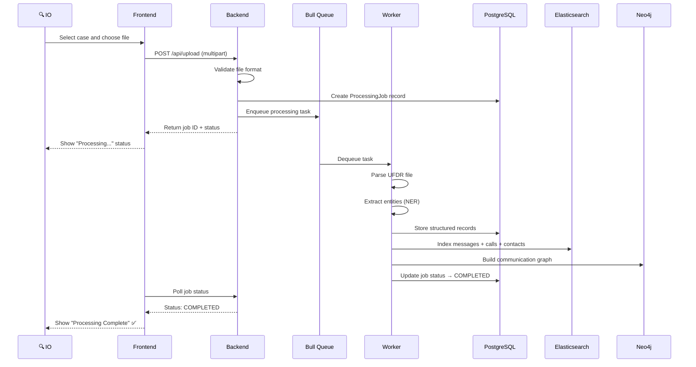
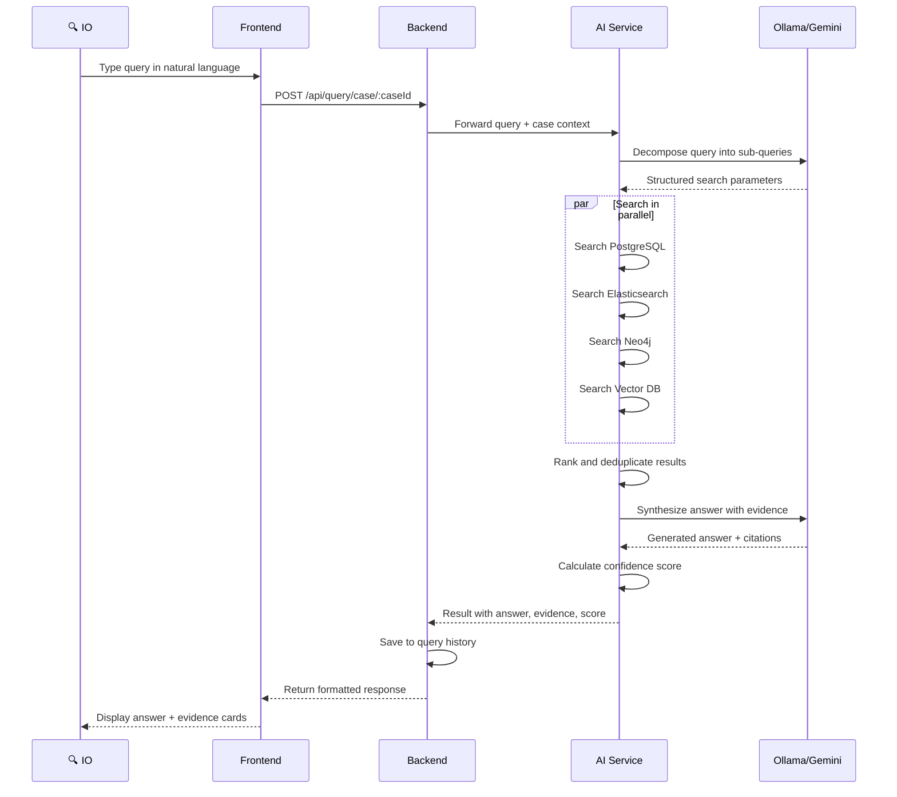
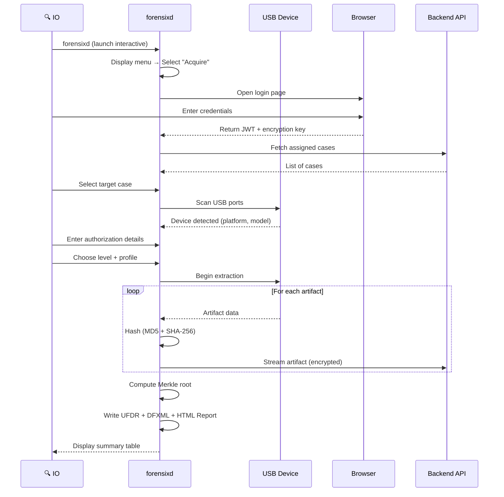
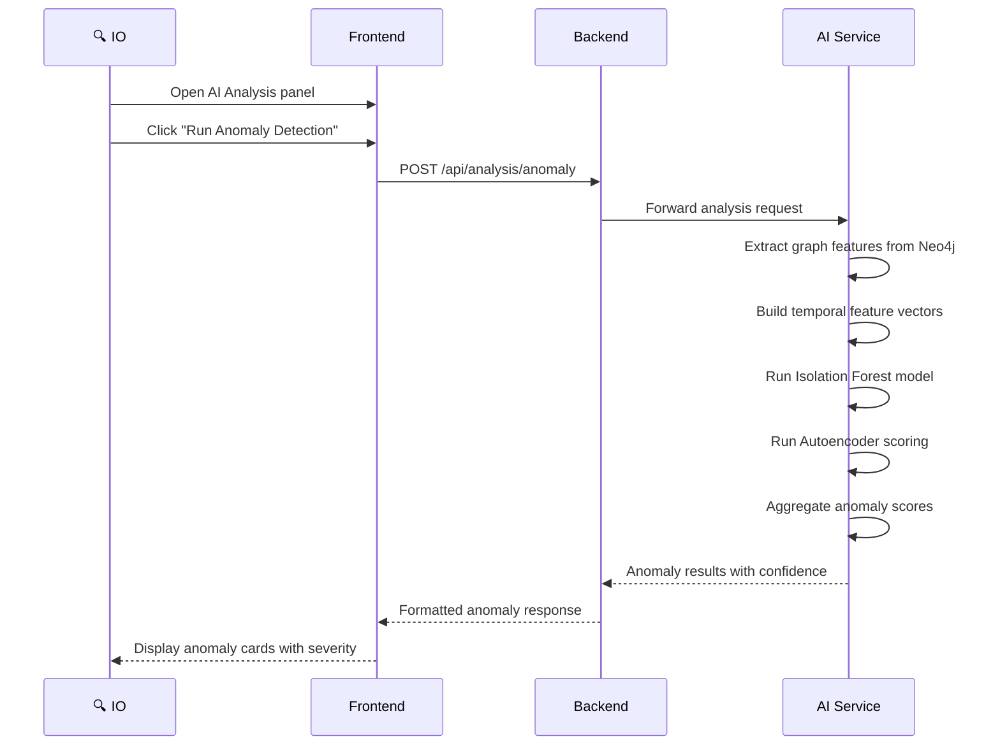
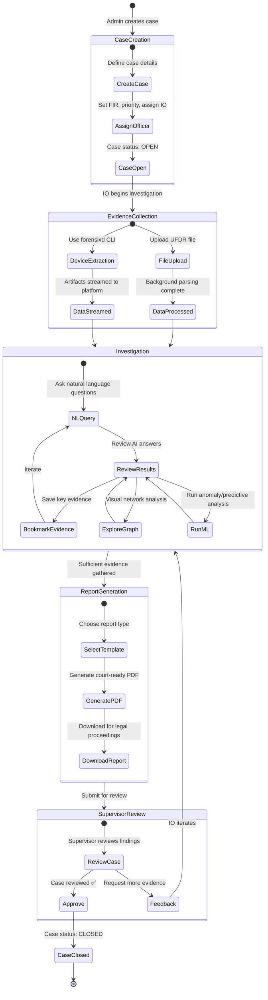

# CopSight AI — Use Case Diagrams

This document maps all system actors to their use cases, showing how each role interacts with the platform features.

---

## System Actors

| Actor | Description | Access Scope |
|-------|-------------|-------------|
| **Admin** | System administrator responsible for user management, case creation, and system configuration | Full platform access |
| **Investigating Officer (IO)** | Field officer conducting the investigation — uploads evidence, runs queries, generates reports | Only their assigned cases |
| **Supervisor** | Oversight role that monitors investigation progress and reviews case completion | Read-only access to unit's cases |
| **forensixd CLI** | Automated tool actor — the standalone extraction tool that streams device data to the platform | API-only access via authenticated session |

---

## Complete Use Case Diagram

```mermaid
graph TB
    Admin(("👨‍💼 Admin"))
    IO(("🔍 Investigating<br/>Officer"))
    Supervisor(("👁️ Supervisor"))
    CLI(("🔧 forensixd"))

    subgraph UserMgmt["User Management"]
        UC1["UC-1<br/>Create User Account"]
        UC2["UC-2<br/>Manage User Roles"]
        UC3["UC-3<br/>Reset User Password"]
        UC4["UC-4<br/>Deactivate User"]
    end

    subgraph CaseMgmt["Case Management"]
        UC5["UC-5<br/>Create Investigation Case"]
        UC6["UC-6<br/>Assign Case to Officer"]
        UC7["UC-7<br/>Track Case Status"]
        UC8["UC-8<br/>Review & Close Case"]
    end

    subgraph Evidence["Evidence Processing"]
        UC9["UC-9<br/>Upload UFDR Evidence File"]
        UC10["UC-10<br/>Monitor Processing Status"]
        UC11["UC-11<br/>Browse Evidence Entities"]
    end

    subgraph Query["AI Query & Analysis"]
        UC12["UC-12<br/>Execute Natural Language Query"]
        UC13["UC-13<br/>View Query History"]
        UC14["UC-14<br/>Bookmark Evidence"]
        UC15["UC-15<br/>Explore Network Graph"]
    end

    subgraph AI["AI-Powered Investigation"]
        UC16["UC-16<br/>Run Anomaly Detection"]
        UC17["UC-17<br/>Run Predictive Analytics"]
        UC18["UC-18<br/>View Cross-Case Connections"]
        UC19["UC-19<br/>Manage Alert Rules"]
    end

    subgraph Reports["Reporting"]
        UC20["UC-20<br/>Generate PDF Report"]
        UC21["UC-21<br/>View Report History"]
    end

    subgraph Extraction["Device Extraction"]
        UC22["UC-22<br/>Authenticate via Browser"]
        UC23["UC-23<br/>Run Forensic Acquisition"]
        UC24["UC-24<br/>Verify Chain of Custody"]
        UC25["UC-25<br/>Stream Data to Platform"]
    end

    subgraph System["System Operations"]
        UC26["UC-26<br/>View System Dashboard"]
        UC27["UC-27<br/>Monitor Performance"]
        UC28["UC-28<br/>Change Own Password"]
    end

    Admin --> UC1 & UC2 & UC3 & UC4
    Admin --> UC5 & UC6 & UC7 & UC8
    Admin --> UC26 & UC27
    Admin --> UC28

    IO --> UC9 & UC10 & UC11
    IO --> UC12 & UC13 & UC14 & UC15
    IO --> UC16 & UC17 & UC18 & UC19
    IO --> UC20 & UC21
    IO --> UC22 & UC23 & UC24 & UC25
    IO --> UC28

    Supervisor --> UC7 & UC8
    Supervisor --> UC11
    Supervisor --> UC13
    Supervisor --> UC21
    Supervisor --> UC26
    Supervisor --> UC28

    CLI --> UC22 & UC23 & UC24 & UC25

    style Admin fill:#e94560,color:#fff
    style IO fill:#0f3460,color:#fff
    style Supervisor fill:#2d6a4f,color:#fff
    style CLI fill:#533483,color:#fff

    style UserMgmt fill:#1a1a2e,stroke:#e94560,color:#fff
    style CaseMgmt fill:#1a1a2e,stroke:#0f3460,color:#fff
    style Evidence fill:#1a1a2e,stroke:#533483,color:#fff
    style Query fill:#1a1a2e,stroke:#0f3460,color:#fff
    style AI fill:#1a1a2e,stroke:#c9184a,color:#fff
    style Reports fill:#1a1a2e,stroke:#2d6a4f,color:#fff
    style Extraction fill:#1a1a2e,stroke:#533483,color:#fff
    style System fill:#1a1a2e,stroke:#e94560,color:#fff
```

---

## Actor Permissions Matrix

| Use Case | Admin | IO | Supervisor | forensixd |
|----------|:-----:|:--:|:----------:|:---------:|
| **User Management** | | | | |
| UC-1 Create User Account | ✅ | — | — | — |
| UC-2 Manage User Roles | ✅ | — | — | — |
| UC-3 Reset User Password | ✅ | — | — | — |
| UC-4 Deactivate User | ✅ | — | — | — |
| **Case Management** | | | | |
| UC-5 Create Investigation Case | ✅ | — | — | — |
| UC-6 Assign Case to Officer | ✅ | — | — | — |
| UC-7 Track Case Status | ✅ | ✅ (own) | ✅ (unit) | — |
| UC-8 Review & Close Case | ✅ | — | ✅ | — |
| **Evidence Processing** | | | | |
| UC-9 Upload UFDR Evidence File | — | ✅ (own) | — | — |
| UC-10 Monitor Processing Status | — | ✅ (own) | — | — |
| UC-11 Browse Evidence Entities | — | ✅ (own) | ✅ (unit) | — |
| **AI Query & Analysis** | | | | |
| UC-12 Execute Natural Language Query | — | ✅ (own) | — | — |
| UC-13 View Query History | — | ✅ (own) | ✅ (unit) | — |
| UC-14 Bookmark Evidence | — | ✅ (own) | — | — |
| UC-15 Explore Network Graph | — | ✅ (own) | — | — |
| **AI-Powered Investigation** | | | | |
| UC-16 Run Anomaly Detection | — | ✅ (own) | — | — |
| UC-17 Run Predictive Analytics | — | ✅ (own) | — | — |
| UC-18 View Cross-Case Connections | — | ✅ (own) | — | — |
| UC-19 Manage Alert Rules | — | ✅ (own) | — | — |
| **Reporting** | | | | |
| UC-20 Generate PDF Report | — | ✅ (own) | — | — |
| UC-21 View Report History | — | ✅ (own) | ✅ (unit) | — |
| **Device Extraction** | | | | |
| UC-22 Authenticate via Browser | — | ✅ | — | ✅ |
| UC-23 Run Forensic Acquisition | — | ✅ | — | ✅ |
| UC-24 Verify Chain of Custody | — | ✅ | — | ✅ |
| UC-25 Stream Data to Platform | — | ✅ | — | ✅ |
| **System** | | | | |
| UC-26 View System Dashboard | ✅ | — | ✅ | — |
| UC-27 Monitor Performance | ✅ | — | — | — |
| UC-28 Change Own Password | ✅ | ✅ | ✅ | — |

---

## Use Case Details

### UC-9: Upload UFDR Evidence File

**Actor:** Investigating Officer

**Preconditions:**
- Officer is authenticated and logged in
- Officer has been assigned to at least one case
- File is in supported format (UFDR/XML/JSON)

**Main Flow:**

**Postconditions:**
- Evidence data is searchable via natural language queries
- Communication network graph is populated
- Processing job marked as COMPLETED

---

### UC-12: Execute Natural Language Query

**Actor:** Investigating Officer

**Preconditions:**
- Officer has access to the case
- Case has processed evidence data

**Main Flow:**

---

### UC-23: Run Forensic Acquisition

**Actor:** Investigating Officer (via forensixd CLI)

**Preconditions:**
- forensixd binary is available on the machine
- Device is connected via USB and trusted
- Officer has valid credentials and case assignment

**Main Flow:**

---

### UC-16: Run Anomaly Detection

**Actor:** Investigating Officer

**Main Flow:**

---

## Investigation Workflow — Complete Lifecycle

The following diagram shows the typical end-to-end flow of a forensic investigation through the platform:

