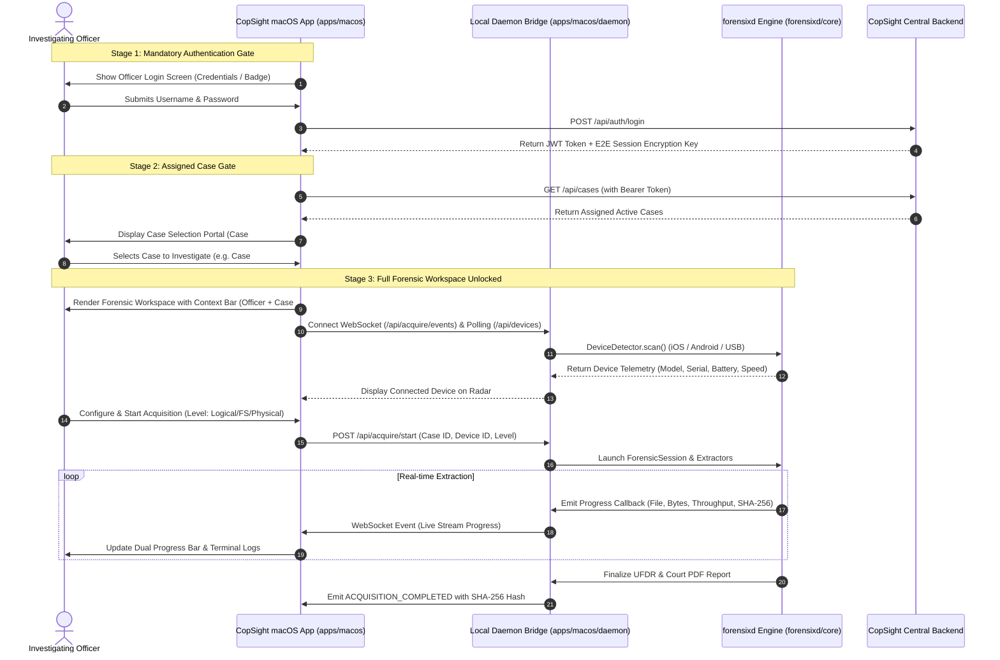

# CopSight Cross-Platform Desktop Architecture & macOS Implementation Design

**Date:** 2026-08-16  
**Status:** Approved by User  
**Target Platform:** macOS (Apple Silicon & Intel), modularized under `apps/macos` with cross-platform architecture (`apps/windows`, `apps/linux`).

---

## 1. Directory & Architectural Isolation (`apps/`)

To guarantee zero regression and ensure clean maintenance, all desktop applications are isolated within a dedicated `apps/` root directory. The existing `forensixd` CLI, `frontend`, and `backend-node` remain completely pristine and unaffected.

```
UFDR/
├── apps/
│   ├── macos/                     # Dedicated macOS Desktop Application
│   │   ├── src/                   # React + TypeScript + Tailwind Frontend
│   │   │   ├── assets/            # Minimal technical SVGs & forensic iconography
│   │   │   ├── components/        # Cyber-forensic UI widgets (Radar, LiveConsole, ContextHeader)
│   │   │   ├── pages/             # AuthGate (Stage 1), CaseGate (Stage 2), Workspace (Stage 3)
│   │   │   ├── store/             # Zustand stores (Auth, Case, Daemon)
│   │   │   └── lib/               # Central API & local daemon WebSocket clients
│   │   ├── daemon/                # Local FastAPI/WebSocket bridge linking into forensixd modules
│   │   │   ├── __init__.py
│   │   │   ├── server.py          # Local RPC/WebSocket daemon server
│   │   │   └── session_bridge.py  # Event-driven adapter for forensixd extraction engine
│   │   ├── scripts/               # macOS .app and .dmg builder scripts
│   │   │   └── build_macos_app.py
│   │   ├── Info.plist             # Native macOS Bundle Metadata
│   │   └── package.json           # Isolated frontend dependencies & build scripts
│   ├── windows/                   # Windows platform architecture scaffold
│   │   └── README.md
│   └── linux/                     # Linux platform architecture scaffold
│       └── README.md
├── forensixd/                     # Core Forensic Engine (Unmodified & Pure)
├── frontend/                      # Web Frontend (Unmodified & Pure)
└── backend-node/                  # Central Case Management Backend (Unmodified & Pure)
```

---

## 2. Strict Security & Operational Workflow



---

## 3. Minimal, Technical & Modern UI Design Language

The frontend inside `apps/macos/src` utilizes a refined **minimalist cyber-forensic design system**:
- **Palette**: Deep slate background (`#090d16`), obsidian cards (`#0e1424`), subtle tactical borders (`#1e293b`), sharp indigo/cyan accents (`#00f0ff` / `#6366f1`), and crisp status indicators.
- **Typography**: Inter for crisp UI hierarchy + JetBrains Mono for cryptographic hashes, timestamps, baud rates, and live terminal logs.
- **Iconography & Graphics**: Sleek Lucide technical glyphs (ShieldCheck, Cpu, HardDrive, Usb, Terminal, Activity, FileCheck, Hash, Layers).
- **Interactive Telemetry**: Live radar sweeping pulse for device discovery, dynamic bit-rate throughput meters, split-pane forensic tree view, and live SHA-256 integrity verification badge.

---

## 4. Packaging & Distribution Pipeline

- `apps/macos/scripts/build_macos_app.py`:
  1. Compiles frontend assets into `apps/macos/dist/`.
  2. Embeds local Python daemon bridge and links `forensixd` package dependencies.
  3. Constructs the official `CopSight.app` directory hierarchy with `Info.plist` and `logo.icns`.
  4. Bundles `CopSight.app` into a signed and distribution-ready `.dmg` installer with `/Applications` symlink.
